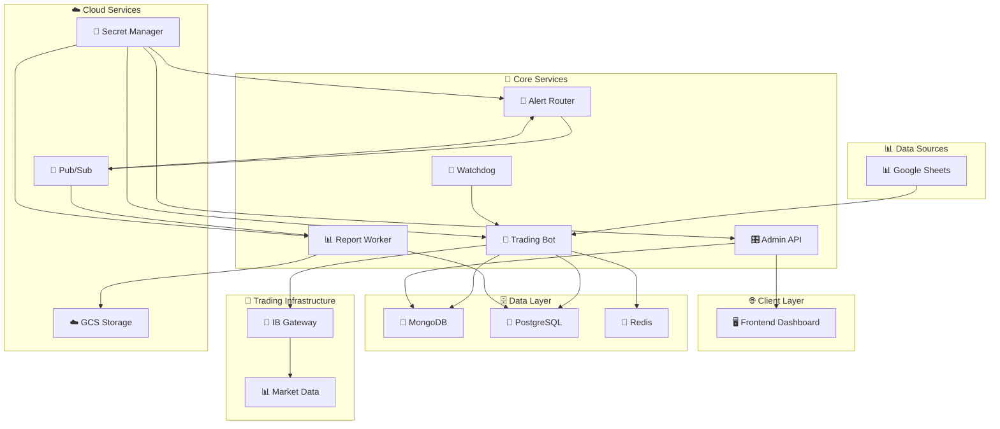
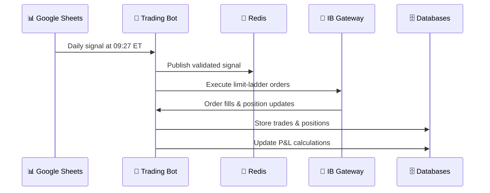
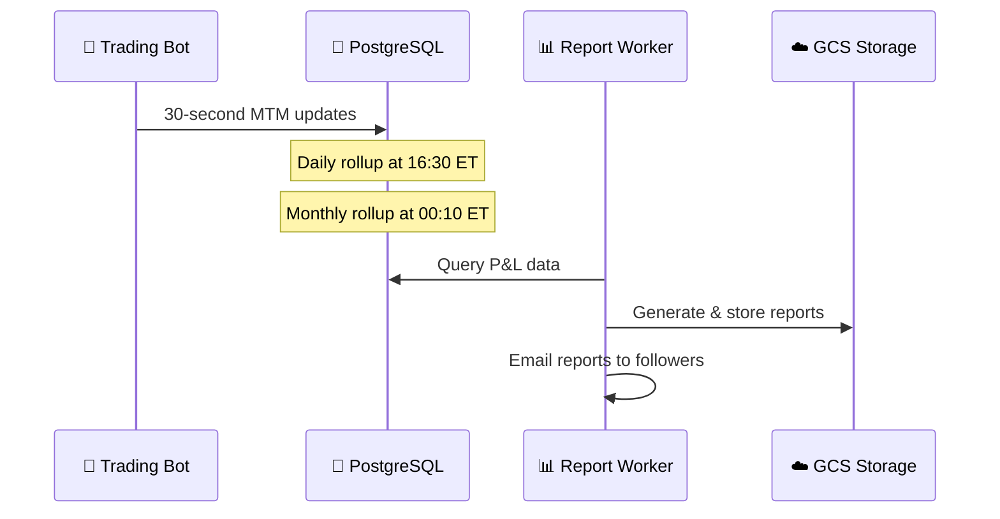
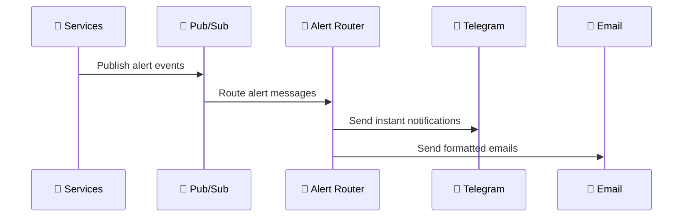

# 🏛️ SpreadPilot System Architecture

> 🚀 **Comprehensive system design** for the SpreadPilot automated trading platform - microservices architecture built for scale, reliability, and performance

This document provides a complete architectural overview of SpreadPilot, a sophisticated copy-trading platform that automates QQQ options strategies from Google Sheets to Interactive Brokers accounts using modern cloud-native principles.

---

## 🎯 Architectural Overview

SpreadPilot is built as a **microservices architecture** on Google Cloud Platform, designed for:

- ⚡ **High Performance** - Real-time trading with 30-second P&L updates
- 🛡️ **Reliability** - Fault-tolerant design with automatic recovery
- 📈 **Scalability** - Horizontal scaling with containerized services
- 🔐 **Security** - Multi-layer security with JWT auth and secrets management
- 📊 **Observability** - Comprehensive monitoring with OpenTelemetry

### 🏗️ **System Diagram**

---

## 🧩 Core Services Architecture

### 🤖 **Trading Bot** - *Core Trading Engine*

The heart of SpreadPilot's automated trading system.

**🎯 Primary Responsibilities:**
- 📈 **Signal Processing** - Google Sheets polling and validation at 09:27 ET
- ⚡ **Order Execution** - Advanced limit-ladder execution with pre-trade margin checks
- 📊 **Position Management** - Real-time position tracking and assignment handling
- 💰 **P&L Calculation** - 30-second MTM updates with PostgreSQL storage
- ⚠️ **Risk Management** - Time value monitoring with automatic liquidation (TV < $0.10)
- 🚨 **Alert Generation** - Real-time notifications for critical events

**🏗️ Architecture Components:**
- 🎛️ **TradingService** - Main orchestrator and service coordinator
- 🏦 **IBKRClient** - Interactive Brokers API wrapper with connection management
- 📡 **SignalProcessor** - Google Sheets integration and signal validation
- 📋 **PositionManager** - Position tracking, assignment detection, and lifecycle management
- 💰 **PnLService** - Real-time P&L calculations with PostgreSQL integration
- ⚠️ **TimeValueMonitor** - Risk management and automatic liquidation engine
- 🔔 **AlertManager** - Notification generation and alert routing

**🔧 Technology Stack:**
- 🐍 **Python 3.11+** with FastAPI framework
- 🔄 **Asyncio** for high-performance concurrent operations
- 🍃 **MongoDB** for trading data and configuration
- 🐘 **PostgreSQL** for P&L analytics and commission tracking
- 🔴 **Redis** for Pub/Sub messaging and signal caching

### 🎛️ **Admin API** - *Management Backend*

RESTful backend service providing comprehensive system management capabilities.

**🎯 Primary Responsibilities:**
- 👥 **Follower Management** - Complete CRUD operations for trading accounts
- 🔐 **Authentication** - JWT-based security with bcrypt password hashing
- 🔌 **Real-time Updates** - WebSocket support for live dashboard data
- 📊 **System Monitoring** - Health checks and performance metrics
- 🚨 **Alert Management** - System notification coordination

**🏗️ Architecture Components:**
- 🔐 **AuthService** - JWT authentication and user management
- 👥 **FollowerService** - Trading account management and configuration
- 📊 **MonitoringService** - System health and performance tracking
- 🔌 **WebSocketManager** - Real-time data streaming to frontend
- 🚨 **AlertHandler** - System alert processing and notification

**🔧 Technology Stack:**
- 🐍 **Python 3.11+** with FastAPI framework
- 🍃 **MongoDB** with Motor async driver
- 🔐 **JWT** authentication with bcrypt password hashing
- 🔌 **WebSockets** for real-time communication
- 📊 **Pydantic** for data validation and serialization

### 📊 **Report Worker** - *Professional Report Generation*

Advanced report generation service with cloud storage integration.

**🎯 Primary Responsibilities:**
- 📄 **PDF Reports** - Professional layouts with ReportLab integration
- 📊 **Excel Reports** - Structured spreadsheets with pandas/openpyxl
- ☁️ **Cloud Storage** - GCS bucket integration with signed URL generation
- 💰 **P&L Integration** - Real-time data from PostgreSQL with commission calculations
- 📧 **Email Delivery** - Automated report distribution via SendGrid
- ⏰ **Scheduled Processing** - Google Cloud Pub/Sub triggered workflows
- 📅 **Weekly Email Reports** - Cron-based commission report emails every Monday

**🏗️ Architecture Components:**
- 📄 **ReportGenerator** - Core report generation engine with GCS integration
- 💰 **PnLDataService** - PostgreSQL integration for P&L and commission data
- ☁️ **GCSManager** - Google Cloud Storage operations and signed URL generation
- 📧 **EmailService** - SendGrid integration for report delivery
- ⏰ **JobProcessor** - Pub/Sub message handling and workflow coordination

**🔧 Technology Stack:**
- 🐍 **Python 3.11+** with Flask for Pub/Sub handling
- 📄 **ReportLab** for professional PDF generation
- 📊 **Pandas/OpenPyXL** for Excel report creation
- ☁️ **Google Cloud Storage** for secure file storage
- 🐘 **PostgreSQL** for P&L and commission data
- 📮 **Google Cloud Pub/Sub** for event-driven processing

### 🔔 **Alert Router** - *Intelligent Notification System*

Centralized alert management and multi-channel notification delivery.

**🎯 Primary Responsibilities:**
- 📮 **Alert Processing** - Pub/Sub event consumption and message formatting
- 🤖 **Telegram Integration** - Real-time notifications with deep links
- 📧 **Email Notifications** - Professional alert emails via SendGrid
- 🎯 **Smart Routing** - Channel selection based on alert severity and type
- 🔗 **Deep Linking** - Dashboard integration for alert context

**🏗️ Architecture Components:**
- 📮 **AlertProcessor** - Pub/Sub message handling and event processing
- 🤖 **TelegramService** - Bot integration and message formatting
- 📧 **EmailService** - SendGrid integration with template management
- 🎯 **RoutingEngine** - Alert channel selection and delivery logic
- 🔗 **LinkGenerator** - Deep link creation for dashboard integration

**🔧 Technology Stack:**
- 🐍 **Python 3.11+** with FastAPI framework
- 📮 **Google Cloud Pub/Sub** for event processing
- 🤖 **Telegram Bot API** for instant notifications
- 📧 **SendGrid** for professional email delivery
- 🔐 **MongoDB** for configuration and secrets management

### 👀 **Watchdog** - *System Health Monitor*

Proactive monitoring and automatic recovery system for critical components.

**🎯 Primary Responsibilities:**
- 🔍 **Health Monitoring** - Continuous service health checks and status tracking
- 🔄 **Auto-Recovery** - Automatic restart of failed components
- 📊 **Status Tracking** - System state management in MongoDB
- 🚨 **Alert Generation** - Critical failure notifications and escalation
- 📈 **Performance Monitoring** - Resource usage and performance metrics

**🏗️ Architecture Components:**
- 🔍 **HealthChecker** - Service endpoint monitoring and validation
- 🔄 **RecoveryManager** - Automatic restart and recovery procedures
- 📊 **StatusTracker** - System state persistence and history
- 🚨 **AlertGenerator** - Critical event detection and notification
- 📈 **MetricsCollector** - Performance data collection and analysis

**🔧 Technology Stack:**
- 🐍 **Python 3.11+** with asyncio for concurrent monitoring
- 🍃 **MongoDB** for status tracking and configuration
- 🔄 **Docker API** for container management
- 📊 **Prometheus** for metrics collection
- 🚨 **Pub/Sub** for alert event publishing

### 🖥️ **Frontend** - *Administrative Dashboard*

Modern React-based dashboard for system management and monitoring.

**🎯 Primary Responsibilities:**
- 🔐 **User Authentication** - Secure login with JWT token management
- 👥 **Follower Management** - Complete trading account administration
- 📊 **Real-time Monitoring** - Live system status and performance metrics
- 📄 **Log Console** - Real-time log streaming and filtering
- 🎛️ **System Control** - Manual operations and emergency controls

**🏗️ Architecture Components:**
- 🔐 **AuthModule** - Login/logout and token management
- 👥 **FollowerModule** - Account management interface
- 📊 **DashboardModule** - System overview and metrics display
- 📄 **LogsModule** - Real-time log display and filtering
- 🎛️ **ControlModule** - Manual system operations

**🔧 Technology Stack:**
- ⚛️ **React 18** with TypeScript for type safety
- 🎨 **Tailwind CSS** for modern, responsive design
- ⚡ **Vite** for fast development and build processes
- 🔌 **WebSocket** for real-time data updates
- 🎯 **React Query** for efficient data fetching and caching

---

## 🏗️ Shared Infrastructure

### 🔧 **SpreadPilot Core** - *Foundation Library*

Comprehensive shared library providing common functionality across all services.

**🧩 Core Modules:**
- 🏦 **IBKR Client** - Interactive Brokers API wrapper with connection management
- 📊 **Data Models** - Pydantic models for MongoDB and SQLAlchemy models for PostgreSQL
- 📝 **Logging** - Structured logging with OpenTelemetry integration
- 🛠️ **Utilities** - PDF/Excel generation, email/Telegram messaging, time utilities
- 🗄️ **Database** - MongoDB and PostgreSQL connection management
- 🔐 **Security** - Authentication helpers and secrets management

**🔧 Technology Stack:**
- 🐍 **Python 3.11+** with modern async/await patterns
- 📊 **Pydantic v2** for data validation and serialization
- 🐘 **SQLAlchemy 2.0** with async support for PostgreSQL
- 🍃 **Motor** for async MongoDB operations
- 📄 **ReportLab** for PDF generation
- 📊 **OpenPyXL/Pandas** for Excel operations

### 🗄️ **Data Layer Architecture**

#### 🍃 **MongoDB** - *Primary Operational Database*

**📊 Collections & Usage:**
- 👥 **Followers** - Trading account configuration and credentials
- 📋 **Positions** - Current trading positions and real-time state
- 💼 **Trades** - Historical trade records and execution details
- 🚨 **Alerts** - System notifications and alert history
- ⚙️ **Configuration** - System settings and feature flags
- 🔐 **Secrets** - Encrypted credentials and API keys

#### 🐘 **PostgreSQL** - *Analytics & P&L Database*

**📊 Tables & Schema:**
- 💰 **pnl_daily** - Daily P&L calculations with MTM data
- 📅 **pnl_monthly** - Monthly P&L rollups with performance metrics
- 💳 **commission_monthly** - Commission calculations with IBAN tracking
- 📈 **trades** - Trade execution records with pricing data
- 📊 **quotes** - Market data and pricing history

#### 🔴 **Redis** - *High-Performance Caching*

**🎯 Usage Patterns:**
- 📡 **Pub/Sub Messaging** - Trading signal distribution
- 💾 **Signal Caching** - Temporary signal storage and validation
- ⚡ **Session Storage** - Authentication token caching
- 📊 **Rate Limiting** - API request throttling and control

---

## 🔄 Communication Patterns

### ⚡ **Synchronous Communication**

#### 🌐 **REST APIs**
- 🎛️ **Admin API** ↔ 🖥️ **Frontend** - Management operations and data retrieval
- 👀 **Watchdog** ↔ 🎯 **All Services** - Health check endpoints and status monitoring
- 🏦 **Trading Bot** ↔ **IB Gateway** - Real-time trading operations and market data

#### 🔌 **WebSocket Connections**
- 🎛️ **Admin API** ↔ 🖥️ **Frontend** - Real-time dashboard updates and log streaming
- 🏦 **IB Gateway** ↔ 🤖 **Trading Bot** - Live market data and position updates

### 🔄 **Asynchronous Communication**

#### 🔴 **Redis Pub/Sub**
- 📡 **Signal Distribution** - Trading signals from Google Sheets to Trading Bot
- 💾 **Cache Invalidation** - Distributed cache management
- ⚡ **Event Broadcasting** - Internal service notifications

#### 📮 **Google Cloud Pub/Sub**
- 🚨 **Alert Events** - Critical notifications from all services to Alert Router
- 📊 **Report Triggers** - Scheduled report generation jobs to Report Worker
- 📈 **Analytics Events** - Performance metrics and business intelligence data

---

## 📊 Data Flow Architecture

### 1️⃣ **Trading Signal Flow**

### 2️⃣ **P&L Calculation Flow**

### 3️⃣ **Alert & Monitoring Flow**

---

## 🛡️ Security Architecture

### 🔐 **Authentication & Authorization**

- 🎫 **JWT Tokens** - Stateless authentication with configurable expiration
- 🔒 **Bcrypt Hashing** - Industry-standard password security
- 👤 **Role-based Access** - Granular permission management
- 🔑 **API Key Management** - Secure service-to-service authentication

### 🔐 **Secrets Management**

- 🏗️ **HashiCorp Vault** - Centralized secrets storage and rotation
- ☁️ **GCP Secret Manager** - Cloud-native secrets for production
- 🍃 **MongoDB Secrets** - Encrypted credential storage for development
- 🔄 **Automatic Rotation** - Scheduled credential updates

### 🛡️ **Network Security**

- 🌐 **Private VPC** - Isolated network for service communication
- 🔥 **Firewall Rules** - Strict ingress/egress controls
- 🔒 **TLS Encryption** - End-to-end encryption for all communications
- 🎯 **Load Balancing** - Traffic distribution with health checks

---

## 📈 Scalability & Performance

### ⚡ **Horizontal Scaling**

- 🐳 **Containerization** - Docker containers for consistent deployment
- ☁️ **Cloud Run** - Serverless container platform with auto-scaling
- 🔄 **Stateless Design** - Services designed for easy horizontal scaling
- 📊 **Load Balancing** - Automatic traffic distribution

### 🚀 **Performance Optimization**

- ⚡ **Async Processing** - Non-blocking I/O for high throughput
- 💾 **Intelligent Caching** - Redis-based caching for frequently accessed data
- 📊 **Connection Pooling** - Efficient database connection management
- 🎯 **Optimized Queries** - Database indexing and query optimization

### 📊 **Database Scaling**

- 🍃 **MongoDB Scaling** - Horizontal sharding and replica sets
- 🐘 **PostgreSQL Optimization** - Indexing, partitioning, and read replicas
- 📈 **Analytics Separation** - Dedicated P&L database for analytics workloads
- 💾 **Caching Layer** - Redis for high-frequency read operations

---

## 🛡️ Resilience & Reliability

### 🔄 **Fault Tolerance**

- 👀 **Health Monitoring** - Continuous service health checks
- 🔄 **Auto-Recovery** - Automatic restart of failed components
- 🚨 **Circuit Breakers** - Failure isolation and graceful degradation
- 📊 **Retry Logic** - Exponential backoff for transient failures

### 📊 **Monitoring & Observability**

- 📈 **OpenTelemetry** - Distributed tracing and metrics collection
- 📊 **Prometheus** - Time-series metrics storage and querying
- 📱 **Grafana** - Visual dashboards and alerting
- 📄 **Structured Logging** - JSON-formatted logs with correlation IDs

### 💾 **Data Backup & Recovery**

- 🔄 **Automated Backups** - Regular database snapshots
- 📊 **Point-in-time Recovery** - Granular data restoration
- 🌍 **Multi-region Storage** - Geographic redundancy for critical data
- 🧪 **Disaster Recovery Testing** - Regular recovery procedure validation

---

## 🎯 Recent Architectural Enhancements (v1.1.7.0)

### ✨ **Enhanced Report Generation System**

- 📄 **Professional PDF Reports** - ReportLab-based layouts with daily P&L tables
- 📊 **Advanced Excel Reports** - Pandas/OpenPyXL with sophisticated formatting
- ☁️ **GCS Integration** - Secure cloud storage with signed URL access
- 🔗 **Signed URL Generation** - Time-limited secure access (24-hour default)
- 💳 **Commission Integration** - IBAN tracking and payment processing

### 💰 **Real-time P&L System**

- ⏱️ **30-second MTM Updates** - Real-time mark-to-market calculations
- 🐘 **PostgreSQL Migration** - Dedicated analytics database for P&L data
- 📅 **Automated Rollups** - Daily (16:30 ET) and monthly (00:10 ET) aggregation
- 💳 **Commission Calculation** - Automated monthly commission on positive P&L
- 📊 **Performance Analytics** - Win/loss ratios and performance metrics

### ⚠️ **Advanced Risk Management**

- ⏰ **Time Value Monitoring** - Continuous TV tracking with automatic liquidation
- 🔒 **Pre-trade Validation** - Margin checks before order execution
- 📊 **Position Limits** - Configurable risk controls per follower
- 🚨 **Real-time Alerts** - Instant notifications for risk events

### 🏗️ **Service Consolidation**

- 📂 **Unified Naming Convention** - Consistent hyphenated directory structure
- 🧹 **Code Deduplication** - Consolidated multiple service implementations
- 📚 **Enhanced Documentation** - Comprehensive guides and API documentation
- 🎨 **Standardized Architecture** - Consistent patterns across all services

---

## 🔮 Future Architecture Considerations

### 📈 **Planned Enhancements**

- 🤖 **Machine Learning Integration** - Predictive analytics for trading signals
- 🌍 **Multi-region Deployment** - Geographic distribution for global users
- 📊 **Advanced Analytics** - Business intelligence and performance dashboards
- 🔄 **Event Sourcing** - Complete audit trail and event replay capabilities

### 🔧 **Technical Debt & Improvements**

- 🐘 **Complete PostgreSQL Migration** - Move remaining MongoDB data to PostgreSQL
- 🏗️ **Microservices Decomposition** - Further service separation for scalability
- 🧪 **Enhanced Testing** - Comprehensive integration and end-to-end testing
- 📊 **Performance Optimization** - Database query optimization and caching improvements

---

**🏛️ Building tomorrow's trading infrastructure today**

[🚀 Deployment Guide](./02-deployment-guide.md) • [🛠️ Development Guide](./03-development-guide.md) • [🔧 Operations Guide](./04-operations-guide.md)

---

**📈 SpreadPilot v1.1.7.0** - *Next-Generation Automated Trading Architecture*

