# 🏛️ SpreadPilot System Architecture

> 🚀 **Comprehensive system design** for the SpreadPilot automated trading platform - microservices architecture built for scale, reliability, and performance

This document provides a complete architectural overview of SpreadPilot, a sophisticated copy-trading platform that automates QQQ options strategies from Google Sheets to Interactive Brokers accounts using modern cloud-native principles.

---

## 🎯 Architectural Overview

SpreadPilot is built as a **microservices architecture** on Google Cloud Platform, designed for:

- ⚡ **High Performance** - Real-time trading with 30-second P&L updates
- 🛡️ **Reliability** - Fault-tolerant design with automatic recovery
- 📈 **Scalability** - Horizontal scaling with containerized services
- 🔐 **Security** - Multi-layer security with JWT auth and secrets management
- 📊 **Observability** - Comprehensive monitoring with OpenTelemetry

### 🏗️ **System Diagram**

```mermaid
graph TB
    subgraph "📊 Data Sources"
        A[📊 Google Sheets]
    end
    
    subgraph "🎯 Core Services"
        B[🤖 Trading Bot]
        C[🎛️ Admin API]
        D[📊 Report Worker]
        E[🔔 Alert Router]
        F[👀 Watchdog]
    end
    
    subgraph "🌐 Client Layer"
        G[🖥️ Frontend Dashboard]
        G2[📱 Admin Dashboard]
    end
    
    subgraph "🗄️ Data Layer"
        H[🍃 MongoDB]
        I[🐘 PostgreSQL]
        J[🔴 Redis]
    end
    
    subgraph "🏦 Trading Infrastructure"
        K[🏦 IB Gateway]
        L[📊 Market Data]
    end
    
    subgraph "☁️ Cloud Services"
        M[☁️ GCS Storage]
        N[📮 Pub/Sub]
        O[🔐 Secret Manager]
    end
    
    A --> B
    B --> K
    B --> H
    B --> I
    B --> J
    B -->|Alert Stream| E
    C --> H
    C --> G
    C --> G2
    D --> I
    D --> M
    E --> J
    E --> N
    F -->|Health Check| B
    F -->|Health Check| C
    F -->|Health Check| D
    F -->|Health Check| E
    F -->|Alert Stream| J
    K --> L
    N --> D
    N --> E
    O --> B
    O --> C
    O --> D
    O --> E
```



---

## 🧩 Core Services Architecture

### 🤖 **Trading Bot** - *Core Trading Engine*

The heart of SpreadPilot's automated trading system.

**🎯 Primary Responsibilities:**
- 📈 **Signal Processing** - Google Sheets polling and validation at 09:27 ET
- ⚡ **Order Execution** - Advanced limit-ladder execution with pre-trade margin checks
- 📊 **Position Management** - Real-time position tracking and assignment handling
- 💰 **P&L Calculation** - 30-second MTM updates with PostgreSQL storage
- ⚠️ **Risk Management** - Time value monitoring with automatic liquidation (TV < $0.10)
- 🚨 **Alert Generation** - Real-time notifications via Redis Streams for execution failures
- 🔴 **Redis Alert Publishing** - Publishes NO_MARGIN, MID_TOO_LOW, LIMIT_REACHED, GATEWAY_UNREACHABLE alerts

**🏗️ Architecture Components:**
- 🎛️ **TradingService** - Main orchestrator and service coordinator
- 🏦 **IBKRClient** - Interactive Brokers API wrapper with connection management
- 📡 **SignalProcessor** - Google Sheets integration and signal validation
- 📋 **PositionManager** - Position tracking, assignment detection, and lifecycle management
- 💰 **PnLService** - Real-time P&L calculations with PostgreSQL integration
- ⚠️ **TimeValueMonitor** - Risk management and automatic liquidation engine
- 🔔 **AlertManager** - Notification generation and alert routing

**🔧 Technology Stack:**
- 🐍 **Python 3.11+** with FastAPI framework
- 🔄 **Asyncio** for high-performance concurrent operations
- 🍃 **MongoDB** for trading data and configuration
- 🐘 **PostgreSQL** for P&L analytics and commission tracking
- 🔴 **Redis** for Pub/Sub messaging and signal caching

### 🎛️ **Admin API** - *Management Backend*

RESTful backend service providing comprehensive system management capabilities.

**🎯 Primary Responsibilities:**
- 👥 **Follower Management** - Complete CRUD operations for trading accounts
- 🔐 **Authentication** - JWT-based security with bcrypt password hashing
- 🔌 **Real-time Updates** - WebSocket support for live dashboard data
- 📊 **System Monitoring** - Health checks and performance metrics
- 🚨 **Alert Management** - System notification coordination

**🏗️ Architecture Components:**
- 🔐 **AuthService** - JWT authentication and user management
- 👥 **FollowerService** - Trading account management and configuration
- 📊 **MonitoringService** - System health and performance tracking
- 🔌 **WebSocketManager** - Real-time data streaming to frontend
- 🚨 **AlertHandler** - System alert processing and notification

**🔧 Technology Stack:**
- 🐍 **Python 3.11+** with FastAPI framework
- 🍃 **MongoDB** with Motor async driver
- 🔐 **JWT** authentication with bcrypt password hashing
- 🔌 **WebSockets** for real-time communication
- 📊 **Pydantic** for data validation and serialization

### 📊 **Report Worker** - *Professional Report Generation*

Advanced report generation service with cloud storage integration.

**🎯 Primary Responsibilities:**
- 📄 **PDF Reports** - Professional layouts with ReportLab integration
- 📊 **Excel Reports** - Structured spreadsheets with pandas/openpyxl
- ☁️ **Cloud Storage** - GCS bucket integration with signed URL generation
- 💰 **P&L Integration** - Real-time data from PostgreSQL with commission calculations
- 📧 **Email Delivery** - Automated report distribution via SendGrid
- ⏰ **Scheduled Processing** - Google Cloud Pub/Sub triggered workflows
- 📅 **Weekly Email Reports** - Cron-based commission report emails every Monday

**🏗️ Architecture Components:**
- 📄 **ReportGenerator** - Core report generation engine with GCS integration
- 💰 **PnLDataService** - PostgreSQL integration for P&L and commission data
- ☁️ **GCSManager** - Google Cloud Storage operations and signed URL generation
- 📧 **EmailService** - SendGrid integration for report delivery
- ⏰ **JobProcessor** - Pub/Sub message handling and workflow coordination

**🔧 Technology Stack:**
- 🐍 **Python 3.11+** with Flask for Pub/Sub handling
- 📄 **ReportLab** for professional PDF generation
- 📊 **Pandas/OpenPyXL** for Excel report creation
- ☁️ **Google Cloud Storage** for secure file storage
- 🐘 **PostgreSQL** for P&L and commission data
- 📮 **Google Cloud Pub/Sub** for event-driven processing

### 🔔 **Alert Router** - *Intelligent Notification System*

Centralized alert management with Telegram-first, email-fallback notification strategy.

**🎯 Primary Responsibilities:**
- 📮 **Alert Processing** - Pub/Sub event consumption and message formatting
- 🤖 **Telegram Priority** - Instant notifications with Markdown formatting and deep links
- 📧 **Email Fallback** - Automatic failover to email when Telegram delivery fails
- 🎯 **Smart Routing** - Telegram-first strategy with intelligent fallback logic
- 🔗 **Deep Linking** - Dashboard integration for immediate alert context
- 🔄 **Concurrent Delivery** - Parallel message sending to multiple recipients

**🏗️ Architecture Components:**
- 📮 **AlertProcessor** - Pub/Sub message handling and event processing
- 🤖 **AlertRouter** - Core routing engine with Telegram priority and email fallback
- 🌐 **HttpxClient** - Async HTTP client for Telegram Bot API integration
- 📧 **EmailService** - SMTP-based email delivery with HTML formatting
- 🎯 **RoutingStrategy** - Implements Telegram-first, email-fallback logic
- 🔗 **LinkGenerator** - Deep link creation for dashboard integration

**🔧 Technology Stack:**
- 🐍 **Python 3.11+** with FastAPI framework
- 📮 **Google Cloud Pub/Sub** for event processing
- 🌐 **httpx** for async Telegram Bot API requests
- 📧 **SMTP/Email** for fallback notifications
- 🔐 **MongoDB** for configuration and secrets management
- ✅ **pytest + httpx mocking** for comprehensive testing

### 👀 **Watchdog** - *Autonomous Container Health Monitor*

Proactive monitoring and automatic recovery system for all SpreadPilot containers labeled with 'spreadpilot'.

**🎯 Primary Responsibilities:**
- 🔍 **Dynamic Discovery** - Automatically discovers containers with 'spreadpilot' label
- 🏥 **Health Monitoring** - HTTP health checks every 30 seconds on exposed ports
- 🔄 **Auto-Recovery** - Docker restart after 3 consecutive failures
- 📊 **Failure Tracking** - Per-container failure count management
- 🚨 **Critical Alerts** - Redis stream publishing for failures and recovery
- ⚡ **Concurrent Monitoring** - Parallel health checks for all discovered containers

**🏗️ Architecture Components:**
- 🔍 **ContainerWatchdog** - Main monitoring orchestrator with asyncio
- 🐳 **Docker SDK** - Container discovery and management via docker-py
- 🌐 **Health Checker** - Automatic port detection and HTTP validation
- 📊 **Failure Counter** - Consecutive failure tracking with cleanup
- 🔴 **Redis Publisher** - Alert stream integration for critical events

**🔧 Technology Stack:**
- 🐍 **Python 3.11+** with asyncio for concurrent monitoring
- 🐳 **docker-py** for Docker API integration
- 🌐 **httpx** for async HTTP health checks
- 🔴 **Redis** for alert stream publishing
- 🏷️ **Container Labels** for automatic service discovery
- ⏱️ **Configurable intervals** via environment variables

### 🖥️ **Frontend** - *Administrative Dashboard*

Modern React-based dashboard for system management and monitoring.

**🎯 Primary Responsibilities:**
- 🔐 **User Authentication** - Secure login with JWT token management
- 👥 **Follower Management** - Complete trading account administration
- 📊 **Real-time Monitoring** - Live system status and performance metrics
- 📄 **Log Console** - Real-time log streaming and filtering
- 🎛️ **System Control** - Manual operations and emergency controls

**🏗️ Architecture Components:**
- 🔐 **AuthModule** - Login/logout and token management
- 👥 **FollowerModule** - Account management interface
- 📊 **DashboardModule** - System overview and metrics display
- 📄 **LogsModule** - Real-time log display and filtering
- 🎛️ **ControlModule** - Manual system operations

**🔧 Technology Stack:**
- ⚛️ **React 18** with TypeScript for type safety
- 🎨 **Tailwind CSS** for modern, responsive design
- ⚡ **Vite** for fast development and build processes
- 🔌 **WebSocket** for real-time data updates
- 🎯 **React Query** for efficient data fetching and caching

### 📱 **Admin Dashboard** - *Mobile-First Management Interface*

Vue 3-based mobile-responsive SPA for on-the-go system management.

**🎯 Primary Responsibilities:**
- 📱 **Mobile-First Design** - Optimized for mobile device management
- 🔐 **JWT Authentication** - Secure token-based access control
- 👥 **Follower Overview** - Quick access to follower status and metrics
- 🚦 **Time Value Monitoring** - Real-time risk indicators (SAFE/RISK/CRITICAL)
- 📊 **System Logs** - Filtered log viewing with real-time updates

**🏗️ Architecture Components:**
- 🧭 **Vue Router** - Client-side routing for SPA navigation
- 📡 **API Service** - Axios-based API communication layer
- 🎨 **Responsive Layout** - Mobile drawer and desktop sidebar navigation
- 🔄 **Composables** - Reusable logic for real-time data polling
- 🏷️ **Risk Badges** - Color-coded time value indicators

**🔧 Technology Stack:**
- 🖼️ **Vue 3** with Composition API and `<script setup>`
- 🎨 **Tailwind CSS** with Forms plugin for mobile UI
- ⚡ **Vite** for instant HMR and optimized builds
- 🔌 **Axios** for REST API integration
- 📱 **Mobile-First** responsive design patterns

---

## 🏗️ Shared Infrastructure

### 🔧 **SpreadPilot Core** - *Foundation Library*

Comprehensive shared library providing common functionality across all services.

**🧩 Core Modules:**
- 🏦 **IBKR Client** - Interactive Brokers API wrapper with connection management
- 📊 **Data Models** - Pydantic models for MongoDB and SQLAlchemy models for PostgreSQL
- 📝 **Logging** - Structured logging with OpenTelemetry integration
- 🛠️ **Utilities** - PDF/Excel generation, email/Telegram messaging, time utilities
- 🗄️ **Database** - MongoDB and PostgreSQL connection management
- 🔐 **Security** - Authentication helpers and secrets management

**🔧 Technology Stack:**
- 🐍 **Python 3.11+** with modern async/await patterns
- 📊 **Pydantic v2** for data validation and serialization
- 🐘 **SQLAlchemy 2.0** with async support for PostgreSQL
- 🍃 **Motor** for async MongoDB operations
- 📄 **ReportLab** for PDF generation
- 📊 **OpenPyXL/Pandas** for Excel operations

### 🗄️ **Data Layer Architecture**

#### 🍃 **MongoDB** - *Primary Operational Database*

**📊 Collections & Usage:**
- 👥 **Followers** - Trading account configuration and credentials
- 📋 **Positions** - Current trading positions and real-time state
- 💼 **Trades** - Historical trade records and execution details
- 🚨 **Alerts** - System notifications and alert history
- ⚙️ **Configuration** - System settings and feature flags
- 🔐 **Secrets** - Encrypted credentials and API keys

#### 🐘 **PostgreSQL** - *Analytics & P&L Database*

**📊 Tables & Schema:**
- 💰 **pnl_daily** - Daily P&L calculations with MTM data
- 📅 **pnl_monthly** - Monthly P&L rollups with performance metrics
- 💳 **commission_monthly** - Commission calculations with IBAN tracking
- 📈 **trades** - Trade execution records with pricing data
- 📊 **quotes** - Market data and pricing history

#### 🔴 **Redis** - *High-Performance Caching & Streaming*

**🎯 Usage Patterns:**
- 📡 **Pub/Sub Messaging** - Trading signal distribution
- 🚨 **Alert Streaming** - Real-time alerts via Redis Streams ('alerts' channel)
- 💾 **Signal Caching** - Temporary signal storage and validation
- ⚡ **Session Storage** - Authentication token caching
- 📊 **Rate Limiting** - API request throttling and control

**📊 Alert Stream Schema:**
```json
{
  "event_type": "NO_MARGIN | MID_TOO_LOW | LIMIT_REACHED | GATEWAY_UNREACHABLE",
  "message": "Human-readable alert description",
  "timestamp": "ISO 8601 datetime",
  "params": {
    "follower_id": "string",
    "error": "string",
    "additional_context": "varies by alert type"
  }
}
```

---

## 🔄 Communication Patterns

### ⚡ **Synchronous Communication**

#### 🌐 **REST APIs**
- 🎛️ **Admin API** ↔ 🖥️ **Frontend** - Management operations and data retrieval
- 👀 **Watchdog** ↔ 🎯 **All Services** - Health check endpoints and status monitoring
- 🏦 **Trading Bot** ↔ **IB Gateway** - Real-time trading operations and market data

#### 🔌 **WebSocket Connections**
- 🎛️ **Admin API** ↔ 🖥️ **Frontend** - Real-time dashboard updates and log streaming
- 🏦 **IB Gateway** ↔ 🤖 **Trading Bot** - Live market data and position updates

### 🔄 **Asynchronous Communication**

#### 🔴 **Redis Pub/Sub**
- 📡 **Signal Distribution** - Trading signals from Google Sheets to Trading Bot
- 💾 **Cache Invalidation** - Distributed cache management
- ⚡ **Event Broadcasting** - Internal service notifications

#### 📮 **Google Cloud Pub/Sub**
- 🚨 **Alert Events** - Critical notifications from all services to Alert Router
- 📊 **Report Triggers** - Scheduled report generation jobs to Report Worker
- 📈 **Analytics Events** - Performance metrics and business intelligence data

---

## 📊 Data Flow Architecture

### 1️⃣ **Trading Signal Flow**

```mermaid
sequenceDiagram
    participant GS as 📊 Google Sheets
    participant TB as 🤖 Trading Bot
    participant R as 🔴 Redis
    participant IB as 🏦 IB Gateway
    participant DB as 🗄️ Databases
    
    GS->>TB: Daily signal at 09:27 ET
    TB->>R: Publish validated signal
    TB->>IB: Execute limit-ladder orders
    IB->>TB: Order fills & position updates
    TB->>DB: Store trades & positions
    TB->>DB: Update P&L calculations
```



### 2️⃣ **P&L Calculation Flow**


### 3️⃣ **Alert & Monitoring Flow**

```mermaid
sequenceDiagram
    participant TB as 🤖 Trading Bot
    participant RS as 🔴 Redis Stream
    participant PS as 📮 Pub/Sub
    participant AR as 🔔 Alert Router
    participant TG as 🤖 Telegram
    participant EM as 📧 Email
    
    Note over TB: Executor publishes alerts on failures
    TB->>RS: Publish AlertEvent to 'alerts' stream
    Note over RS: Alert types: NO_MARGIN, MID_TOO_LOW,<br/>LIMIT_REACHED, GATEWAY_UNREACHABLE
    
    RS->>AR: Subscribe and consume alerts
    AR->>PS: Forward critical alerts
    PS->>AR: Route alert messages
    AR->>TG: Send instant notifications (Primary)
    alt Telegram Success
        Note over AR: At least one Telegram message delivered
        Note over EM: Email not sent (Telegram succeeded)
    else Telegram Failure
        Note over TG: All Telegram attempts failed
        AR->>EM: Send formatted emails (Fallback)
    end
```



### 4️⃣ **Traefik Reverse Proxy Architecture**

```mermaid
graph TB
    subgraph "🌐 Internet"
        U[👤 Users]
        LE[🔒 Let's Encrypt]
    end
    
    subgraph "🚪 Edge Layer"
        T[🌐 Traefik]
    end
    
    subgraph "🎯 Application Layer"
        API[🔐 Admin API]
        DASH[📱 Admin Dashboard]
        TD[🎛️ Traefik Dashboard]
    end
    
    subgraph "📡 Networks"
        WEB[🌐 Web Network]
        INT[🔒 Internal Network]
    end
    
    U -->|HTTPS| T
    T <-->|ACME| LE
    T -->|dashboard.domain| API
    T -->|app.domain| DASH
    T -->|traefik.domain| TD
    
    T -.->|Port 8002| API
    T -.->|Port 80| DASH
    T -.->|Port 8080| TD
    
    API --> INT
    DASH --> INT
    T --> WEB
    WEB --> INT
```



---

## 🛡️ Security Architecture

### 🔐 **Authentication & Authorization**

- 🎫 **JWT Tokens** - Stateless authentication with configurable expiration
- 🔒 **Bcrypt Hashing** - Industry-standard password security
- 👤 **Role-based Access** - Granular permission management
- 🔑 **API Key Management** - Secure service-to-service authentication

### 🔐 **Secrets Management**

- 🏗️ **HashiCorp Vault** - Centralized secrets storage and rotation
- ☁️ **GCP Secret Manager** - Cloud-native secrets for production
- 🍃 **MongoDB Secrets** - Encrypted credential storage for development
- 🔄 **Automatic Rotation** - Scheduled credential updates

### 🛡️ **Network Security**

- 🌐 **Private VPC** - Isolated network for service communication
- 🔥 **Firewall Rules** - Strict ingress/egress controls
- 🔒 **TLS Encryption** - End-to-end encryption for all communications
- 🎯 **Load Balancing** - Traffic distribution with health checks

---

## 📈 Scalability & Performance

### ⚡ **Horizontal Scaling**

- 🐳 **Containerization** - Docker containers for consistent deployment
- ☁️ **Cloud Run** - Serverless container platform with auto-scaling
- 🔄 **Stateless Design** - Services designed for easy horizontal scaling
- 📊 **Load Balancing** - Automatic traffic distribution

### 🚀 **Performance Optimization**

- ⚡ **Async Processing** - Non-blocking I/O for high throughput
- 💾 **Intelligent Caching** - Redis-based caching for frequently accessed data
- 📊 **Connection Pooling** - Efficient database connection management
- 🎯 **Optimized Queries** - Database indexing and query optimization

### 📊 **Database Scaling**

- 🍃 **MongoDB Scaling** - Horizontal sharding and replica sets
- 🐘 **PostgreSQL Optimization** - Indexing, partitioning, and read replicas
- 📈 **Analytics Separation** - Dedicated P&L database for analytics workloads
- 💾 **Caching Layer** - Redis for high-frequency read operations

---

## 🛡️ Resilience & Reliability

### 🔄 **Fault Tolerance**

- 👀 **Health Monitoring** - Continuous service health checks
- 🔄 **Auto-Recovery** - Automatic restart of failed components
- 🚨 **Circuit Breakers** - Failure isolation and graceful degradation
- 📊 **Retry Logic** - Exponential backoff for transient failures

### 📊 **Monitoring & Observability**

- 📈 **OpenTelemetry** - Distributed tracing and metrics collection
- 📊 **Prometheus** - Time-series metrics storage and querying
- 📱 **Grafana** - Visual dashboards and alerting
- 📄 **Structured Logging** - JSON-formatted logs with correlation IDs

### 💾 **Data Backup & Recovery**

- 🔄 **Automated Backups** - Regular database snapshots
- 📊 **Point-in-time Recovery** - Granular data restoration
- 🌍 **Multi-region Storage** - Geographic redundancy for critical data
- 🧪 **Disaster Recovery Testing** - Regular recovery procedure validation

---

## 🎯 Recent Architectural Enhancements (v1.1.7.0)

### ✨ **Enhanced Report Generation System**

- 📄 **Professional PDF Reports** - ReportLab-based layouts with daily P&L tables
- 📊 **Advanced Excel Reports** - Pandas/OpenPyXL with sophisticated formatting
- ☁️ **GCS Integration** - Secure cloud storage with signed URL access
- 🔗 **Signed URL Generation** - Time-limited secure access (24-hour default)
- 💳 **Commission Integration** - IBAN tracking and payment processing

### 💰 **Real-time P&L System**

- ⏱️ **30-second MTM Updates** - Real-time mark-to-market calculations
- 🐘 **PostgreSQL Migration** - Dedicated analytics database for P&L data
- 📅 **Automated Rollups** - Daily (16:30 ET) and monthly (00:10 ET) aggregation
- 💳 **Commission Calculation** - Automated monthly commission on positive P&L
- 📊 **Performance Analytics** - Win/loss ratios and performance metrics

### ⚠️ **Advanced Risk Management**

- ⏰ **Time Value Monitoring** - Continuous TV tracking with automatic liquidation
- 🔒 **Pre-trade Validation** - Margin checks before order execution
- 📊 **Position Limits** - Configurable risk controls per follower
- 🚨 **Real-time Alerts** - Instant notifications for risk events

### 🏗️ **Service Consolidation**

- 📂 **Unified Naming Convention** - Consistent hyphenated directory structure
- 🧹 **Code Deduplication** - Consolidated multiple service implementations
- 📚 **Enhanced Documentation** - Comprehensive guides and API documentation
- 🎨 **Standardized Architecture** - Consistent patterns across all services

---

## 🔮 Future Architecture Considerations

### 📈 **Planned Enhancements**

- 🤖 **Machine Learning Integration** - Predictive analytics for trading signals
- 🌍 **Multi-region Deployment** - Geographic distribution for global users
- 📊 **Advanced Analytics** - Business intelligence and performance dashboards
- 🔄 **Event Sourcing** - Complete audit trail and event replay capabilities

### 🔧 **Technical Debt & Improvements**

- 🐘 **Complete PostgreSQL Migration** - Move remaining MongoDB data to PostgreSQL
- 🏗️ **Microservices Decomposition** - Further service separation for scalability
- 🧪 **Enhanced Testing** - Comprehensive integration and end-to-end testing
- 📊 **Performance Optimization** - Database query optimization and caching improvements

---

<div align="center">

**🏛️ Building tomorrow's trading infrastructure today**

[🚀 Deployment Guide](./02-deployment-guide.md) • [🛠️ Development Guide](./03-development-guide.md) • [🔧 Operations Guide](./04-operations-guide.md)

---

**📈 SpreadPilot v1.1.7.0** - *Next-Generation Automated Trading Architecture*

</div>