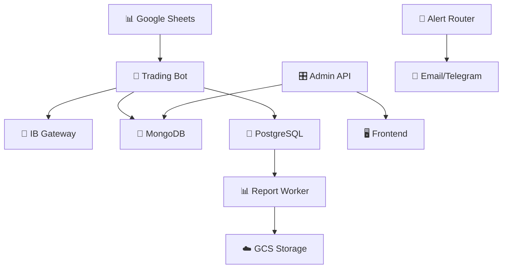

# 📚 SpreadPilot Documentation

> 📖 **Comprehensive documentation hub** for the SpreadPilot automated trading platform - your complete guide to architecture, deployment, development, and operations

Welcome to the SpreadPilot documentation center! This collection provides everything you need to understand, deploy, develop, and maintain the SpreadPilot copy-trading platform for QQQ options strategies.

---

## 🗂️ Documentation Structure

### 🏗️ **Core Documentation**

| 📄 Document | 🎯 Purpose | 👥 Audience |
|-------------|------------|-------------|
| 🏛️ [**System Architecture**](./01-system-architecture.md) | Complete system overview, components, and data flow | Architects, Developers, DevOps |
| 🚀 [**Deployment Guide**](./02-deployment-guide.md) | Production deployment to Google Cloud Platform | DevOps, SREs, Deployment Engineers |
| 🛠️ [**Development Guide**](./03-development-guide.md) | Local development, testing, and code organization | Developers, Contributors |
| 🔧 [**Operations Guide**](./04-operations-guide.md) | Monitoring, maintenance, and troubleshooting | SREs, Operations Teams |

### 🎯 **Specialized Guides**

| 📄 Document | 🎯 Purpose | 🔄 Status |
|-------------|------------|-----------|
| 🔐 [**Vault Integration**](./vault-integration.md) | HashiCorp Vault setup and credential management | ✅ Updated |
| 🏦 [**Gateway Manager**](./gateway-manager.md) | IB Gateway container management | ✅ Updated |
| ⚡ [**Order Execution**](./order-execution.md) | Advanced limit-ladder execution strategy | ✅ Updated |
| 📊 [**Vertical Spreads Strategy**](./vertical_spreads_strategy_implementation.md) | QQQ options strategy implementation | ✅ Updated |

### 🔧 **Setup Guides**

The `setup/` directory contains step-by-step service setup guides:

| 📄 Guide | 🎯 Service | ⏱️ Est. Time |
|----------|------------|--------------|
| 🗄️ [**MongoDB Setup**](./setup/0-mongodb.md) | Database configuration | 15 min |
| 🏦 [**IB Gateway Setup**](./setup/1-ib-gateway.md) | Interactive Brokers connection | 30 min |
| 🤖 [**Trading Bot Setup**](./setup/2-trading-bot.md) | Core trading engine | 20 min |
| 🎛️ [**Admin API Setup**](./setup/3-admin-api.md) | Backend API service | 15 min |
| 🖥️ [**Frontend Setup**](./setup/4-frontend.md) | React dashboard | 10 min |
| 🔔 [**Alert Router Setup**](./setup/5-alert-router.md) | Notification service | 10 min |
| 📊 [**Report Worker Setup**](./setup/6-report-worker.md) | PDF/Excel report generation | 15 min |

---

## 🎨 Visual Architecture

### 📊 **System Diagrams**

The `images/` directory contains architectural diagrams:

- 🏛️ **`system-architecture.mmd`** - High-level system overview with service interactions
- 🔍 **`reference-architecture.mmd`** - Detailed technical architecture with data flows

### 🎯 **Quick Architecture Overview**



---

## 🚀 Quick Navigation

### 🎯 **By Role**

#### 👨‍💻 **Developers**
- 🛠️ [Development Guide](./03-development-guide.md) - Local setup and coding standards
- 🏗️ [System Architecture](./01-system-architecture.md) - Component understanding
- 📚 [Service READMEs](../README.md#architecture) - Individual service documentation

#### 🚀 **DevOps Engineers**
- 🚀 [Deployment Guide](./02-deployment-guide.md) - Production deployment
- 🔐 [Vault Integration](./vault-integration.md) - Secrets management
- 🔧 [Operations Guide](./04-operations-guide.md) - Monitoring and maintenance

#### 🏛️ **System Architects**
- 🏗️ [System Architecture](./01-system-architecture.md) - Complete system design
- 📊 [Vertical Spreads Strategy](./vertical_spreads_strategy_implementation.md) - Trading logic
- ⚡ [Order Execution](./order-execution.md) - Execution engine design

#### 🔧 **Operations Teams**
- 🔧 [Operations Guide](./04-operations-guide.md) - Day-to-day operations
- 🚨 [Troubleshooting](./04-operations-guide.md#troubleshooting) - Issue resolution
- 📊 [Monitoring](./04-operations-guide.md#monitoring) - System health

### 📋 **By Task**

#### 🚀 **Getting Started**
1. 📖 [Project Overview](../README.md) - Understanding SpreadPilot
2. 🏗️ [System Architecture](./01-system-architecture.md) - System components
3. 🛠️ [Development Guide](./03-development-guide.md) - Local setup

#### 🏗️ **Setting Up Services**
1. 🗄️ [MongoDB](./setup/0-mongodb.md) → 🏦 [IB Gateway](./setup/1-ib-gateway.md)
2. 🤖 [Trading Bot](./setup/2-trading-bot.md) → 🎛️ [Admin API](./setup/3-admin-api.md) 
3. 🖥️ [Frontend](./setup/4-frontend.md) → 🔔 [Alerts](./setup/5-alert-router.md)
4. 📊 [Reports](./setup/6-report-worker.md)

#### ☁️ **Deploying to Production**
1. 🚀 [Deployment Guide](./02-deployment-guide.md) - GCP deployment
2. 🔐 [Vault Setup](./vault-integration.md) - Secrets management
3. 🔧 [Operations](./04-operations-guide.md) - Post-deployment

---

## 🏗️ Platform Features (v1.1.7.0)

### 🎯 **Latest Features**
- ✅ **Enhanced Report Generation** - Professional PDF/Excel reports with GCS integration
- ✅ **Commission Calculation** - Automated monthly commission with IBAN tracking
- ✅ **Real-time P&L System** - PostgreSQL-based P&L with 30-second MTM updates
- ✅ **Time Value Monitoring** - Automatic liquidation when TV < $0.10

### 🛡️ **Risk Management**
- ⚠️ **Time Value Monitoring** - Automatic position liquidation
- 💰 **Real-time P&L Tracking** - 30-second mark-to-market calculations
- 🔒 **Pre-trade Margin Checks** - Validation before order execution
- 📊 **Position Limits** - Configurable risk controls per follower

### 📊 **Reporting & Analytics**
- 📄 **Professional Reports** - PDF and Excel with daily P&L breakdowns
- ☁️ **Cloud Storage** - Secure GCS storage with signed URL access
- 💳 **Commission Tracking** - IBAN integration for payment processing
- 📈 **Real-time Dashboard** - Live monitoring and system status

---

## 🔧 Development Standards

### 📁 **Folder Structure Convention**

SpreadPilot uses **hyphenated directory names** for consistency across deployment environments:

```bash
spreadpilot/
├── trading-bot/          # 🤖 Core trading engine
├── admin-api/            # 🎛️ Backend API service  
├── report-worker/        # 📊 Report generation
├── alert-router/         # 🔔 Notification service
└── spreadpilot-core/     # 🏗️ Shared library
```

### 🐍 **Python Import Pattern**

For hyphenated directories, use `importlib.import_module()`:

```python
import importlib

# ✅ Correct import method
trading_service = importlib.import_module('trading-bot.app.service.base')
admin_schemas = importlib.import_module('admin-api.app.schemas.follower')

# Access classes
TradingService = trading_service.TradingService
FollowerSchema = admin_schemas.FollowerCreate
```

### 🎨 **Documentation Standards**

- 📝 **Markdown Format** - All documentation in Markdown
- 🎨 **Emoji Categories** - Consistent emoji usage for visual hierarchy
- 🔗 **Cross-references** - Proper linking between documents
- 📊 **Diagrams** - Mermaid syntax for visual representations
- 🧪 **Code Examples** - Working code snippets with syntax highlighting

---

## 🔄 Keeping Documentation Updated

### 📅 **Regular Updates**

Documentation is updated with each release to reflect:

- ✅ **New Features** - Latest functionality and capabilities
- 🔧 **Configuration Changes** - Updated environment variables and settings
- 🚀 **Deployment Updates** - New deployment procedures and requirements
- 🐛 **Bug Fixes** - Resolved issues and workarounds

### 📋 **Update Process**

1. **🔄 Feature Development** - Update docs alongside code changes
2. **📝 Review Cycle** - Documentation review with each PR
3. **🚀 Release Updates** - Version-specific documentation updates
4. **🔍 Quarterly Review** - Comprehensive documentation audit

### 🎯 **Current Version Coverage**

All documentation reflects **SpreadPilot v1.1.7.0** features:

- ✅ Enhanced PDF/Excel report generation
- ✅ GCS bucket integration with signed URLs
- ✅ PostgreSQL P&L system with real-time updates
- ✅ Commission calculation with IBAN tracking
- ✅ Time value monitoring and liquidation

---

## 🤝 Contributing to Documentation

### 📝 **Contribution Guidelines**

1. 🍴 **Fork** the repository
2. 🔍 **Review** existing documentation structure
3. ✏️ **Make changes** following our emoji and formatting standards
4. 📊 **Update diagrams** if architectural changes are involved
5. 🧪 **Test examples** to ensure they work correctly
6. 📋 **Submit PR** with clear description of changes

### 🎨 **Style Guidelines**

- 📝 **Clear Headers** - Descriptive section titles with appropriate emojis
- 🔗 **Proper Links** - Working internal and external references  
- 📊 **Code Blocks** - Syntax highlighting for all code examples
- 🎯 **Consistent Formatting** - Follow established patterns
- 📋 **Table Usage** - Structured information in tables where appropriate

### 🧪 **Documentation Testing**

- ✅ **Link Validation** - Ensure all links work correctly
- 🧪 **Code Examples** - Test all provided code snippets
- 📱 **Format Check** - Verify rendering in different Markdown viewers
- 🔍 **Accuracy Review** - Validate technical accuracy

---

## 📞 Support & Resources

### 🔗 **Related Documentation**

- 📖 [**Main Project README**](../README.md) - Project overview and quick start
- 🏗️ [**SpreadPilot Core**](../spreadpilot-core/README.md) - Shared library documentation
- 🤖 [**Trading Bot**](../trading-bot/README.md) - Core trading engine docs
- 🎛️ [**Admin API**](../admin-api/README.md) - Backend service documentation

### 🆘 **Getting Help**

- 📋 **Documentation Issues** - Check existing docs first
- 🔍 **Technical Questions** - Review troubleshooting guides
- 🐛 **Bug Reports** - Include relevant logs and configuration
- 💡 **Feature Requests** - Reference existing architecture

---

## 📄 License

This documentation is part of the SpreadPilot project and is licensed under the **MIT License** - see the [LICENSE](../LICENSE) file for details.

---

<div align="center">

**📚 Your complete guide to SpreadPilot mastery**

[🚀 Quick Start](../README.md#quick-start) • [🏗️ Architecture](./01-system-architecture.md) • [🛠️ Development](./03-development-guide.md) • [🚀 Deployment](./02-deployment-guide.md)

---

**📈 SpreadPilot v1.1.7.0** - *Professional Automated Trading Platform*

</div>