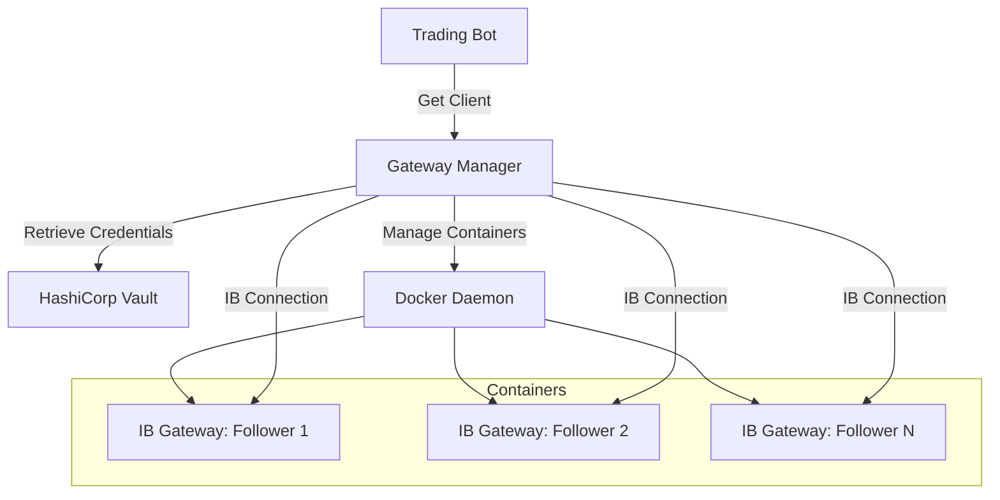

# Gateway Manager

The Gateway Manager is a core service component that manages Interactive Brokers Gateway (IB Gateway) Docker containers for multiple follower accounts. It provides automatic container lifecycle management, health monitoring, and connection handling.

## Overview

The Gateway Manager handles:
- Dynamic Docker container creation and management for each follower
- Automatic credential retrieval from HashiCorp Vault
- Connection health monitoring and automatic reconnection
- Resource allocation (ports and client IDs)
- Graceful shutdown and cleanup

## Key Features

### 1. Vault Integration with Retry Logic
The Gateway Manager retrieves IBKR credentials from HashiCorp Vault with automatic retry:
- **Exponential backoff**: 3 retry attempts with exponential delays
- **Secure credential storage**: No credentials stored in code or config files
- **Automatic fallback**: Falls back to stored credentials if Vault is unavailable

### 2. Docker Container Management
Each follower gets a dedicated IB Gateway container:
- **Automatic container creation**: Containers launched on-demand
- **Port allocation**: Dynamic port assignment from configurable range (4100-4200)
- **Client ID management**: Random client ID assignment to avoid conflicts
- **Container cleanup**: Automatic removal of stopped containers

### 3. Health Monitoring
Continuous monitoring ensures gateway availability:
- **30-second heartbeat checks**: Regular health verification
- **Connection status monitoring**: Uses `ib_insync.isConnected()` for reliable status
- **Automatic reconnection**: Reconnects dropped connections automatically
- **Container status tracking**: Monitors Docker container health

### 4. Connection Management
Robust connection handling with retry logic:
- **Exponential backoff on connection failures**: Up to 5 retries over 60 seconds
- **Connection pooling**: Reuses existing connections when available
- **Graceful disconnection**: Proper cleanup on shutdown

## Architecture



## API Reference

### Core Methods

#### `start()` 
Starts the gateway manager and loads enabled followers from MongoDB.

#### `stop()`
Gracefully stops all gateways and cleans up resources.

#### `get_client(follower_id: str) -> IB | None`
Returns a connected IB client for the specified follower.

#### `launch_gateway(follower_id: str)`
Launches a new gateway container for a specific follower.

#### `stop_gateway(follower_id: str)`
Stops the gateway container for a specific follower.

#### `is_healthy(follower_id: str) -> bool`
Checks if a follower's gateway is healthy and connected.

#### `reconnect(follower_id: str) -> bool`
Attempts to reconnect a disconnected IB client.

### Status Tracking

The Gateway Manager tracks container status using the `GatewayStatus` enum:
- `STARTING`: Container is starting up
- `RUNNING`: Container is running and connected
- `STOPPED`: Container has stopped
- `FAILED`: Container or connection has failed

## Configuration

### Environment Variables
```python
gateway_image: str = "ghcr.io/gnzsnz/ib-gateway:latest"
port_range_start: int = 4100
port_range_end: int = 4200
client_id_range_start: int = 1000
client_id_range_end: int = 9999
container_prefix: str = "ibgateway-follower"
healthcheck_interval: int = 30  # seconds
max_startup_time: int = 120  # seconds
vault_enabled: bool = True
```

### Vault Configuration
Each follower must have a `vault_secret_ref` field pointing to their IBKR credentials in Vault:
```json
{
  "id": "follower_123",
  "vault_secret_ref": "ibkr/follower_123",
  "enabled": true,
  "state": "ACTIVE"
}
```

## Usage Example

```python
from spreadpilot_core.ibkr.gateway_manager import GatewayManager

# Initialize gateway manager
gateway_manager = GatewayManager()

# Start the manager
await gateway_manager.start()

# Get IB client for a follower
ib_client = await gateway_manager.get_client("follower_123")

# Check health status
is_healthy = gateway_manager.is_healthy("follower_123")

# Launch a new gateway
await gateway_manager.launch_gateway("follower_456")

# Stop a specific gateway
await gateway_manager.stop_gateway("follower_123")

# Graceful shutdown
await gateway_manager.stop()
```

## Error Handling

The Gateway Manager includes comprehensive error handling:
- **Connection failures**: Automatic retry with exponential backoff
- **Container crashes**: Detected during health checks
- **Vault failures**: Retry logic with fallback options
- **Resource exhaustion**: Clear error messages when ports/IDs exhausted

## Monitoring and Observability

The Gateway Manager logs important events:
- Container lifecycle events (start/stop)
- Connection status changes
- Health check results
- Error conditions and recovery attempts

Integration with OpenTelemetry provides:
- Distributed tracing for connection attempts
- Metrics for container health
- Performance monitoring for IB API calls

## Security Considerations

- **Credential isolation**: Each follower has separate credentials
- **Network isolation**: Containers run in isolated network namespace
- **Automatic cleanup**: Credentials removed from memory after use
- **Audit logging**: All credential access is logged