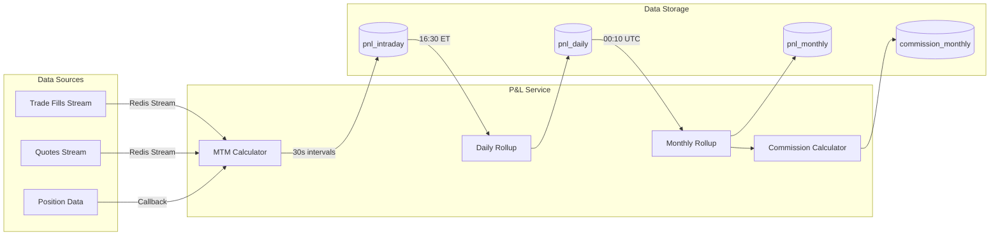

# P&L Service

The P&L Service is a core component that tracks real-time profit and loss, performs daily and monthly aggregations, and calculates commission based on positive monthly performance.

## Overview

The P&L Service provides:
- **Real-time MTM Updates**: Mark-to-market calculations every 30 seconds during market hours
- **Daily Roll-ups**: Aggregation at 16:30 US/Eastern time
- **Monthly Roll-ups**: Aggregation at 00:10 UTC on the 1st of each month
- **Commission Calculation**: Automatic commission calculation on positive monthly P&L
- **Redis Stream Integration**: Real-time processing of trade fills and quotes

## Architecture



## Database Schema

### pnl_intraday
Stores real-time P&L snapshots updated every 30 seconds:
- `follower_id`: Follower identifier
- `snapshot_time`: Timestamp of the snapshot
- `trading_date`: Trading date
- `realized_pnl`: Realized P&L from closed trades
- `unrealized_pnl`: Unrealized P&L from open positions
- `total_pnl`: Total P&L (realized + unrealized)
- `position_count`: Number of open positions
- `total_market_value`: Total market value of positions
- `total_commission`: Commission paid

### pnl_daily
Daily aggregated P&L rolled up at 16:30 ET:
- `follower_id`: Follower identifier
- `trading_date`: Trading date
- `opening_balance`: Opening balance
- `closing_balance`: Closing balance
- `realized_pnl`: Daily realized P&L
- `total_pnl`: Total daily P&L
- `trades_count`: Number of trades
- `total_volume`: Trading volume
- `total_commission`: Total commission paid
- `max_drawdown`: Maximum drawdown
- `max_profit`: Maximum profit
- `is_finalized`: Whether rollup is complete

### pnl_monthly
Monthly aggregated P&L rolled up at 00:10 UTC:
- `follower_id`: Follower identifier
- `year`, `month`: Period identifiers
- `realized_pnl`: Monthly realized P&L
- `total_pnl`: Total monthly P&L
- `trading_days`: Number of trading days
- `total_trades`: Total number of trades
- `best_day_pnl`: Best daily P&L
- `worst_day_pnl`: Worst daily P&L
- `winning_days`: Days with positive P&L
- `losing_days`: Days with negative P&L

### commission_monthly
Monthly commission calculations:
- `follower_id`: Follower identifier
- `year`, `month`: Period identifiers
- `monthly_pnl`: Total monthly P&L
- `commission_pct`: Commission percentage (as decimal)
- `commission_amount`: Calculated commission
- `follower_iban`: IBAN for payment
- `follower_email`: Email for notifications
- `is_payable`: True if P&L > 0
- `is_paid`: Payment status
- `payment_date`: Date of payment
- `payment_reference`: Payment reference

## Key Features

### 1. Real-time MTM Calculation
The service calculates mark-to-market P&L every 30 seconds during market hours:
```python
# MTM Calculation Formula
unrealized_pnl = sum(
    (market_price - avg_cost) * quantity * 100  # For long positions
    (avg_cost - market_price) * abs(quantity) * 100  # For short positions
)
total_pnl = realized_pnl + unrealized_pnl
```

### 2. Redis Stream Integration
Subscribes to two Redis streams for real-time data:
- `trade_fills`: Processes executed trades
- `quotes`: Updates market prices and triggers MTM recalculation

### 3. Daily Roll-up (16:30 ET)
Aggregates intraday data into daily summaries:
- Calculates daily P&L metrics
- Tracks trading activity (trades, volume, commission)
- Records performance metrics (max profit/drawdown)
- Determines winning/losing days

### 4. Monthly Roll-up (00:10 UTC)
Aggregates daily data into monthly summaries:
- Sums daily P&L for the month
- Calculates performance statistics
- Triggers commission calculation
- Stores IBAN and email for payment processing

### 5. Commission Calculation
Commission is calculated only on positive monthly P&L:
```python
if monthly_pnl > 0:
    commission = commission_pct * monthly_pnl
else:
    commission = 0
```

## Usage Example

```python
from spreadpilot_core.pnl.service import PnLService

# Initialize service
pnl_service = PnLService(redis_url="redis://localhost:6379")

# Set callbacks for position data
pnl_service.set_callbacks(
    get_positions_fn=get_follower_positions,
    get_market_price_fn=get_market_price,
    subscribe_tick_fn=subscribe_to_tick_feed
)

# Add followers to track
await pnl_service.add_follower("follower_123")

# Start monitoring
shutdown_event = asyncio.Event()
await pnl_service.start_monitoring(shutdown_event)

# Get current P&L
current_pnl = await pnl_service.get_current_pnl("follower_123")

# Get monthly commission
commission = await pnl_service.get_monthly_commission("follower_123", 2024, 1)
```

## Scheduling

### Daily Roll-up Schedule
- **Time**: 16:30 US/Eastern (after market close)
- **Frequency**: Every trading day
- **Window**: 5-minute execution window

### Monthly Roll-up Schedule
- **Time**: 00:10 UTC on the 1st of each month
- **Frequency**: Monthly
- **Window**: 5-minute execution window

## Performance Considerations

1. **Caching**: Quote data is cached in memory for faster MTM calculations
2. **Batch Processing**: Multiple positions are calculated together
3. **Asynchronous Operations**: All database operations are async
4. **Stream Processing**: Redis streams provide real-time data without polling

## Error Handling

The service includes comprehensive error handling:
- Failed MTM calculations don't stop the service
- Individual follower errors are isolated
- Rollup failures are logged and can be retried
- Redis disconnections are handled gracefully

## Monitoring and Observability

The service logs important events:
- MTM calculation results
- Roll-up completions
- Commission calculations
- Error conditions

Integration with OpenTelemetry provides:
- Distributed tracing for P&L calculations
- Metrics for calculation performance
- Alerts for calculation failures