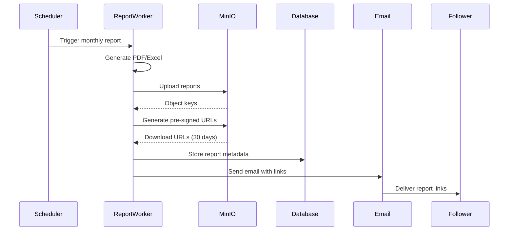

# Report Worker MinIO Integration

## Overview

The Report Worker service has been enhanced with MinIO/S3 integration to provide scalable, secure storage for generated reports. This integration enables:

- **Object Storage**: Store PDF and Excel reports in MinIO buckets
- **Pre-signed URLs**: Generate secure download links valid for 30 days
- **Lifecycle Management**: Automatic object expiration after 180 days
- **Email Optimization**: Send download links instead of large attachments
- **Fallback Support**: Graceful fallback to email attachments if MinIO is unavailable

## Architecture

### Components

1. **MinIOService** (`app/service/minio_service.py`)
   - Manages S3 client connections
   - Handles file uploads with expiration
   - Generates pre-signed URLs
   - Provides health checking

2. **Enhanced Report Service** (`app/service/report_service_enhanced.py`)
   - Orchestrates report generation workflow
   - Integrates MinIO uploads
   - Updates database with report metadata
   - Tracks upload success/failure

3. **Notifier with MinIO** (`app/service/notifier_minio.py`)
   - Sends emails with download links when MinIO is available
   - Falls back to attachments when MinIO is not configured
   - Provides unified interface for report delivery

### Workflow



## Configuration

### Environment Variables

```bash
# MinIO/S3 Configuration
MINIO_ENDPOINT_URL=https://minio.example.com  # MinIO server endpoint
MINIO_ACCESS_KEY=your-access-key              # Access credentials
MINIO_SECRET_KEY=your-secret-key              # Secret credentials
MINIO_BUCKET_NAME=spreadpilot-reports         # Bucket for reports
MINIO_REGION=us-east-1                        # AWS region (default: us-east-1)
MINIO_SECURE=true                             # Use HTTPS (default: true)
```

### Bucket Structure

Reports are organized in a hierarchical structure:

```
spreadpilot-reports/
├── reports/
│   ├── 2025-06/                    # Report period
│   │   ├── follower-123/           # Follower ID
│   │   │   ├── report_2025-06.pdf  # PDF report
│   │   │   └── report_2025-06.xlsx # Excel report
│   │   └── follower-456/
│   │       ├── report_2025-06.pdf
│   │       └── report_2025-06.xlsx
```

## Implementation Details

### File Upload with Expiration

```python
async def upload_report(self, local_file_path: str, object_key: str) -> str | None:
    """Upload a report file to MinIO with 180-day lifecycle."""
    with open(local_file_path, "rb") as file:
        self.s3_client.put_object(
            Bucket=self.bucket_name,
            Key=object_key,
            Body=file,
            Expires=datetime.utcnow() + timedelta(days=180),  # Auto-expire
        )
```

### Pre-signed URL Generation

```python
async def generate_presigned_url(
    self, object_key: str, expiration_days: int = 30
) -> str | None:
    """Generate a pre-signed URL for downloading a report."""
    url = self.s3_client.generate_presigned_url(
        "get_object",
        Params={"Bucket": self.bucket_name, "Key": object_key},
        ExpiresIn=expiration_days * 24 * 3600,  # 30 days
    )
```

### Database Schema

Reports are tracked in MongoDB with the following schema:

```json
{
    "follower_id": "follower-123",
    "report_period": "2025-06",
    "email_sent": true,
    "sent_timestamp": "2025-07-01T00:10:00Z",
    "pdf_url": "https://minio.example.com/...",
    "excel_url": "https://minio.example.com/...",
    "minio_upload": true
}
```

## Email Templates

### With MinIO Links

When MinIO is configured and upload succeeds:

```html
<p>Your monthly report for 2025-06 is ready.</p>

<p>You can download your reports using the links below (valid for 30 days):</p>

<ul>
    <li><a href="{pdf_url}">Download PDF Report</a></li>
    <li><a href="{excel_url}">Download Excel Report</a></li>
</ul>
```

### Fallback to Attachments

When MinIO is not available:

```html
<p>Please find attached your monthly report for 2025-06.</p>

<p>The report includes your performance summary and commission details.</p>
```

## Testing

### Unit Tests with Moto

The service includes comprehensive unit tests using moto for S3 mocking:

```python
@mock_s3
def test_upload_report_success(self, minio_service, test_file):
    """Test successful report upload."""
    # Create mock bucket
    s3_client = boto3.client("s3", ...)
    s3_client.create_bucket(Bucket="test-bucket")
    
    # Upload file
    result = minio_service.upload_report(test_file, object_key)
    assert result == object_key
```

### Integration Testing

For integration testing with a real MinIO instance:

```bash
# Start MinIO locally
docker run -p 9000:9000 -p 9001:9001 \
  -e MINIO_ROOT_USER=minioadmin \
  -e MINIO_ROOT_PASSWORD=minioadmin \
  minio/minio server /data --console-address ":9001"

# Run integration tests
pytest tests/integration/test_report_minio_integration.py
```

## Security Considerations

1. **Access Control**: MinIO credentials should be stored securely (MongoDB secrets)
2. **URL Expiration**: Pre-signed URLs expire after 30 days for security
3. **HTTPS**: Always use secure connections (MINIO_SECURE=true)
4. **Bucket Policies**: Configure appropriate bucket policies in production
5. **Monitoring**: Track failed uploads and expired URLs

## Monitoring and Alerts

The service logs important events:

- Successful uploads: `"Successfully uploaded {file} to {key}"`
- Failed uploads: `"Failed to upload to MinIO: {error}"`
- URL generation: `"Generated pre-signed URL for {key}"`
- Fallback to attachments: `"Using email attachments (MinIO not available)"`

## Performance Optimization

1. **Concurrent Uploads**: PDF and Excel files can be uploaded concurrently
2. **Connection Pooling**: S3 client is cached and reused
3. **Small File Optimization**: Reports are typically <10MB, ideal for direct upload
4. **Retry Logic**: Built-in boto3 retry mechanisms for transient failures

## Future Enhancements

1. **Multipart Upload**: For very large reports (>100MB)
2. **CDN Integration**: CloudFront/Cloudflare for faster downloads
3. **Compression**: Gzip reports before upload
4. **Versioning**: Keep multiple versions of reports
5. **Analytics**: Track download metrics