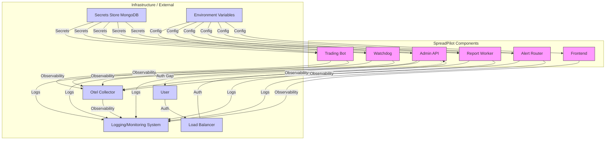
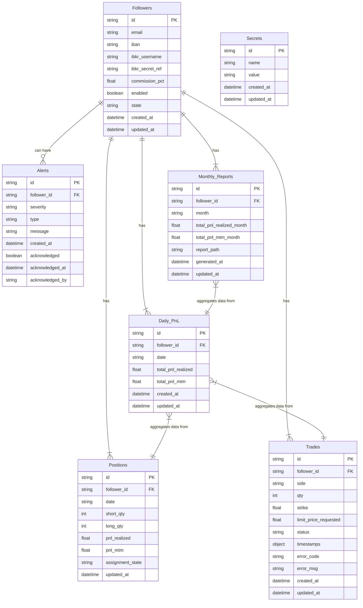

# SpreadPilot System Architecture

This document provides a comprehensive overview of the SpreadPilot trading system's software architecture, detailing its components, their interactions, deployment model, data structure, and key cross-cutting concerns.
## 🚀 System Overview for Stakeholders

SpreadPilot is an automated trading platform that executes option spread strategies on behalf of subscribers (called "followers"). Here's how the system works in simple terms:

### 🔄 Core Workflow

1. 📊 **Signal Generation**: Trading signals are created in Google Sheets by strategy managers
2. 🤖 **Automated Execution**: The Trading Bot reads these signals and automatically places trades for all followers
3. 💼 **Position Management**: The system monitors all open positions and manages assignments/expirations
4. 📱 **Notifications**: Critical alerts are sent via Telegram and email when important events occur
5. 📈 **Reporting**: Monthly performance reports are generated and sent to followers

### 🧩 Key Components

- **Trading Bot** 🤖: The heart of the system that executes trades via Interactive Brokers
- **Admin API** 🛠️: Provides administrative control over followers and system settings
- **Frontend Dashboard** 📊: Web interface for administrators to monitor and control the system
- **Report Worker** 📑: Generates performance reports and P&L calculations
- **Alert Router** 🚨: Ensures critical notifications reach administrators and followers
- **Watchdog** 👀: Monitors system health and detects issues with critical services

### 💰 Business Value

- **Automation** ⚙️: Eliminates manual trading, reducing human error and operational overhead
- **Scalability** 📈: Handles multiple followers with different account sizes and risk profiles
- **Transparency** 🔍: Provides detailed reporting on performance and commissions
- **Reliability** 🛡️: Built-in monitoring, alerting, and failsafes to handle trading edge cases
- **Security** 🔒: Secure storage of credentials and trading parameters

### 🔄 Data Flow

1. Trading signals flow from Google Sheets → Trading Bot → Interactive Brokers
2. Trade confirmations flow from Interactive Brokers → Trading Bot → MongoDB → Admin Dashboard
3. Alerts flow from Trading Bot → Alert Router → Administrators/Followers
4. Reports flow from Report Worker → Email → Followers

This architecture enables a reliable, scalable trading operation that can execute strategies across multiple follower accounts simultaneously while providing transparency and control.

## Component Documentation

This section provides detailed analysis findings for each core component of the SpreadPilot system.

### Trading Bot

**Purpose & Core Functionality**:
The **Trading Bot** ([`trading-bot/`](trading-bot/)) is a service responsible for automated trading operations based on signals. Its primary responsibilities and business capabilities include:
1.  **Signal Consumption**: It polls an external source (Google Sheets, as configured in [`trading-bot/app/sheets.py`](trading-bot/app/sheets.py:1)) for trading signals. These signals dictate the strategy, quantity, and strike prices for trades.
2.  **Order Execution**: Upon receiving a valid signal, it connects to Interactive Brokers (IBKR) for specified followers (defined in `spreadpilot-core/models/follower.py`) and attempts to place vertical spread option orders. This is managed by [`trading-bot/app/service/ibkr.py`](trading-bot/app/service/ibkr.py:1) which uses [`spreadpilot-core/spreadpilot_core/ibkr/client.py`](spreadpilot-core/spreadpilot_core/ibkr/client.py:1).
3.  **Position Management**: It tracks current positions for each follower, storing this data in MongoDB (models like [`spreadpilot-core/spreadpilot_core/models/position.py`](spreadpilot-core/spreadpilot_core/models/position.py:1)). It periodically checks for assignments (unexpected exercise of short options) and can attempt to compensate by exercising corresponding long options. This is handled by [`trading-bot/app/service/positions.py`](trading-bot/app/service/positions.py:1).
4.  **Follower Management**: It loads and manages a list of active "followers" from MongoDB. Trades are executed on behalf of these followers, each having their own IBKR credentials and settings.
5.  **P&L Calculation (Basic)**: It can fetch P&L data from IBKR.
6.  **Alerting**: It generates alerts for significant events (e.g., insufficient margin, order rejections, assignments) and stores them in MongoDB (model [`spreadpilot-core/spreadpilot_core/models/alert.py`](spreadpilot-core/spreadpilot_core/models/alert.py:1)). Critical alerts can trigger notifications (e.g., Telegram). This is managed by [`trading-bot/app/service/alerts.py`](trading-bot/app/service/alerts.py:1).
7.  **Configuration Management**: It loads its operational parameters (IBKR connection details, polling intervals, API keys, etc.) from environment variables and a configuration file ([`trading-bot/app/config.py`](trading-bot/app/config.py:1)). Secrets like API keys and IBKR passwords are pre-loaded from a secure MongoDB collection at startup ([`trading-bot/app/main.py`](trading-bot/app/main.py:1)).
8.  **Original Strategy Handler**: Includes a component ([`trading-bot/app/service/original_strategy_handler.py`](trading-bot/app/service/original_strategy_handler.py:1)) for an EMA crossover strategy, suggesting it can support multiple trading strategies.

The **SpreadPilot Core** ([`spreadpilot-core/`](spreadpilot-core/)) provides shared, reusable components and models for various services within the SpreadPilot ecosystem, including the Trading Bot. Its core functionalities relevant to the Trading Bot are:
1.  **IBKR Client Wrapper** ([`spreadpilot-core/spreadpilot_core/ibkr/client.py`](spreadpilot-core/spreadpilot_core/ibkr/client.py:1)): A Python client that wraps the `ib_insync` library to simplify interactions with the Interactive Brokers API for actions like placing orders, fetching positions, checking margin, and getting P&L.
2.  **Database Models** ([`spreadpilot-core/spreadpilot_core/models/`](spreadpilot-core/spreadpilot_core/models/)): Pydantic models defining the structure for data stored in MongoDB (e.g., `Follower`, `Position`, `Trade`, `Alert`).
3.  **MongoDB Utilities** ([`spreadpilot-core/spreadpilot_core/db/mongodb.py`](spreadpilot-core/spreadpilot_core/db/mongodb.py:1)): Helper functions for connecting to and interacting with MongoDB using `motor`.
4.  **Logging Utilities** ([`spreadpilot-core/spreadpilot_core/logging/logger.py`](spreadpilot-core/spreadpilot_core/logging/logger.py:1)): Standardized logging setup, including optional OpenTelemetry integration.
5.  **Utility Functions** ([`spreadpilot-core/spreadpilot_core/utils/`](spreadpilot-core/spreadpilot_core/utils/)): Various helper utilities, such as time manipulation ([`spreadpilot-core/spreadpilot_core/utils/time.py`](spreadpilot-core/spreadpilot_core/utils/time.py:1)), secret management ([`spreadpilot-core/spreadpilot_core/utils/secrets.py`](spreadpilot-core/spreadpilot_core/utils/secrets.py:1)), and Telegram notifications ([`spreadpilot-core/spreadpilot_core/utils/telegram.py`](spreadpilot-core/spreadpilot_core/utils/telegram.py:1)).

The Trading Bot acts as an execution engine, taking signals and managing trades for multiple users (followers) by leveraging the foundational services provided by SpreadPilot Core.

**Technical Implementation**:
**Languages & Frameworks:**
*   **Python**: The primary language for both `trading-bot` and `spreadpilot-core`.
*   **FastAPI**: The `trading-bot` ([`trading-bot/app/main.py`](trading-bot/app/main.py:1)) is built as a FastAPI application, providing a simple HTTP API for health checks, status, and manual signal/close operations.
*   **Pydantic**: Used extensively in `spreadpilot-core/models/` for data validation and settings management ([`trading-bot/app/config.py`](trading-bot/app/config.py:1)).
*   **`ib_insync`**: The core library used by [`spreadpilot-core/spreadpilot_core/ibkr/client.py`](spreadpilot-core/spreadpilot_core/ibkr/client.py:1) for interacting with the Interactive Brokers API.
*   **`motor`**: Asynchronous Python driver for MongoDB, used in [`spreadpilot-core/spreadpilot_core/db/mongodb.py`](spreadpilot-core/spreadpilot_core/db/mongodb.py:1) and various service components in `trading-bot` for database interactions.
*   **`aiohttp`**: Used by [`trading-bot/app/sheets.py`](trading-bot/app/sheets.py:1) for asynchronous HTTP requests to Google Sheets API.
*   **Asyncio**: Leveraged throughout the `trading-bot` and `spreadpilot-core` for concurrent operations, especially for I/O-bound tasks like API calls (IBKR, Google Sheets, MongoDB) and background polling loops (e.g., [`trading-bot/app/service/base.py`](trading-bot/app/service/base.py:1) `run` method, [`trading-bot/app/service/positions.py`](trading-bot/app/service/positions.py:1) `check_positions_periodically`).

**Design Patterns & Architectural Approaches:**
*   **Service-Oriented Architecture (SOA) / Microservices (Implicit)**: The separation of `trading-bot` and `spreadpilot-core` suggests a modular design. The `trading-bot` itself is a distinct service.
*   **Manager Pattern**: The `trading-bot/app/service/` directory contains several manager classes (e.g., `IBKRManager`, `PositionManager`, `AlertManager`, `SignalProcessor`) that encapsulate specific domains of responsibility within the `TradingService`. This promotes separation of concerns.
*   **Configuration Management**: Settings are centralized in [`trading-bot/app/config.py`](trading-bot/app/config.py:1) using Pydantic's `BaseSettings` for loading from environment variables and `.env` files. Secrets are explicitly pre-loaded from MongoDB at startup.
*   **Asynchronous Programming**: Heavy use of `async/await` for non-blocking I/O operations, crucial for a trading bot that needs to remain responsive while interacting with multiple external services.
*   **Dependency Injection (Lightweight/Implicit)**: The `TradingService` initializes and holds references to its managers and clients (e.g., `sheets_client`, `mongo_db`). These are passed to the managers upon their instantiation.
*   **State Management**: The `TradingService` maintains its operational state (e.g., `ServiceStatus` enum in [`trading-bot/app/service/base.py`](trading-bot/app/service/base.py:35)) and caches active followers. Positions are persisted in MongoDB.
*   **Modular Core Library**: `spreadpilot-core` acts as a shared library, providing common functionalities (IBKR client, DB models, logging, utils) to potentially multiple services, promoting code reuse and consistency.
*   **Polling**: The primary mechanism for fetching signals from Google Sheets is polling ([`trading-bot/app/service/base.py`](trading-bot/app/service/base.py:183)). Position checks are also done periodically.
*   **Error Handling**: `try-except` blocks are used for handling exceptions from external API calls and other operations. A global exception handler is present in [`trading-bot/app/main.py`](trading-bot/app/main.py:269).

### Watchdog

**Purpose & Core Functionality**:
The Watchdog component ([`watchdog/main.py`](watchdog/main.py:0)) serves as a monitoring service within the SpreadPilot trading system. Its primary responsibility is to periodically check the health and operational status of critical dependent services.

Core functionalities include:
- **Scheduled Health Checks**: Regularly polls a predefined list of services at a configurable interval (`CHECK_INTERVAL_SECONDS`, default 60s).
- **Service Monitoring**: Currently configured to monitor: `firestore`, `trading-bot`, `ib-gateway`, and `otel-collector`.
- **Status Logging**: Logs the start and completion of health check cycles, and the (simulated) status of each monitored service.
- **Error Reporting (Placeholder)**: Includes a placeholder to take action (e.g., notification, remediation) if a service is found to be unhealthy. The actual implementation of these actions is not yet present.

The business capability it provides is increased system reliability and awareness by detecting and (potentially) reacting to failures in other parts of the system.

**Technical Implementation**:
- **Language**: Python (version 3.10, as specified in [`watchdog/Dockerfile`](watchdog/Dockerfile:2)).
- **Frameworks/Libraries**: Primarily uses the Python standard library.
    - `logging` for application logging.
    - `time` for managing check intervals (`time.sleep()`).
    - `os` for accessing environment variables (e.g., `WATCHDOG_CHECK_INTERVAL_SECONDS`).
- **Design Patterns/Architectural Approaches**:
    - **Scheduled Polling**: The core mechanism is a `while True` loop that periodically iterates through services and performs health checks.
    - **Centralized Monitoring**: Acts as a central point for observing the health of other services.
    - **Configuration via Environment Variables**: Allows some parameters (like check interval) to be configured externally.
    - **Placeholder Implementation**: The actual health check logic in `check_service_health()` is currently a placeholder and simulates success. A real implementation would require specific checks for each service type (e.g., HTTP pings, DB connections).

### Admin API

**Purpose & Core Functionality**:
The `admin-api` component serves as the backend for the SpreadPilot administration interface. Its primary responsibilities include:
*   **Follower Management**:
    *   Registering new followers (users/accounts that replicate trades).
    *   Listing existing followers.
    *   Enabling/disabling individual followers.
    *   Triggering commands to close all positions for a specific follower (likely by communicating with the `trading-bot`).
*   **Dashboard Backend**:
    *   Providing summarized data and statistics for the admin dashboard (e.g., follower counts).
    *   Serving real-time updates (primarily follower status) to connected dashboard clients via WebSockets.
    *   Exposing placeholder endpoints for alerts and performance metrics, suggesting future expansion.
*   **System Health**:
    *   Providing a basic health check endpoint (`/health`).

The core business capability is to provide administrative oversight and control over the follower accounts within the SpreadPilot trading system, and to offer a real-time view of their status.

**Technical Implementation**:
*   **Language**: Python (version not explicitly specified, but assumed to be 3.x compatible with FastAPI).
*   **Framework**: FastAPI, a modern, high-performance web framework for building APIs with Python.
*   **Asynchronous Operations**: Leverages `asyncio` and `async/await` syntax extensively, suitable for I/O-bound operations like database interactions and WebSocket communication. `anyio` is used for managing background tasks.
*   **Configuration Management**: Uses Pydantic settings (via `admin_api.app.core.config.Settings`) to manage application configuration. Secrets can be pre-loaded from MongoDB into environment variables at startup.
*   **Database**: Interacts with MongoDB for data persistence (e.g., storing follower information). Uses `motor` (an async MongoDB driver).
*   **Modularity**: The code is structured into modules for API endpoints, services, schemas (Pydantic models), database interaction, and core configuration. `importlib` is used for dynamic imports in some places, which might be a pattern to reduce import cycles or manage optional dependencies, though its specific benefit here isn't immediately obvious without deeper context.
*   **Dependency Injection**: FastAPI's `Depends` system is used to manage dependencies, such as injecting database connections and service instances into endpoint functions.
*   **Background Tasks**: A background task (`periodic_follower_update_task`) is managed using `anyio.create_task_group` within the FastAPI lifespan event handler to periodically fetch and broadcast follower updates via WebSockets.
*   **API Versioning**: API endpoints are prefixed with `/api/v1`, indicating a versioned API.
*   **CORS**: Configured with permissive CORS settings (`allow_origins=["*"]`), which should be restricted in production.
*   **Logging**: Uses a centralized logger from `spreadpilot_core.logging`.

### Report Worker

**Purpose & Core Functionality**:
The `report-worker` component is responsible for the following:
*   **Automated Report Generation**: It generates periodic financial reports for followers of the trading strategy. This includes:
    *   **Daily P&L Calculation**: Calculates and stores the profit and loss for all closed positions on a given day.
    *   **Monthly Performance Reports**: Aggregates daily P&L data to produce comprehensive monthly reports. These reports detail overall P&L, commission calculations, and net P&L for each follower.
*   **Report Distribution**: It handles the distribution of these reports, primarily via email, to the respective followers. Reports are generated in PDF and Excel formats.
*   **Event-Driven Processing**: The worker is designed to be triggered by Pub/Sub messages, allowing for scheduled or event-driven report generation (e.g., daily P&L calculation at market close, monthly report generation at the start of a new month).

The core business capability is to provide transparent and timely performance reporting to clients (followers), ensuring they are informed about their investment's progress and associated fees.

**Technical Implementation**:
*   **Language**: Python 3.x
*   **Framework**: Flask is used as the web framework to handle incoming HTTP requests from Google Cloud Pub/Sub (push subscriptions).
*   **Primary Libraries**:
    *   `motor`: Asynchronous Python driver for MongoDB, used for all database interactions (fetching follower data, storing daily/monthly P&L, retrieving closed positions).
    *   `pydantic`: Used for data validation and settings management via models (e.g., `Follower`, `Position` from `spreadpilot-core`).
    *   `reportlab`: For generating PDF reports.
    *   `openpyxl`: For generating Excel reports.
    *   `python-dotenv`: For loading environment variables from `.env` files during local development.
    *   `pytz`: For timezone handling, particularly for determining market close dates.
    *   `sendgrid`: For sending email notifications with report attachments.
    *   `opentelemetry-sdk`, `opentelemetry-exporter-otlp-proto-grpc`: For distributed tracing (though setup seems basic in the core logger).
*   **Design Patterns/Architectural Approaches**:
    *   **Service-Oriented**: The component is a distinct service focused on reporting.
    *   **Event-Driven Architecture (EDA)**: Primarily driven by Pub/Sub messages. The `/` endpoint in `main.py` acts as the subscriber.
    *   **Asynchronous Operations**: Utilizes `asyncio` and `motor` for non-blocking database operations, crucial for handling concurrent requests or long-running report generation tasks efficiently.
    *   **Modular Design**: The service logic is separated into modules:
        *   `main.py`: Flask app setup, Pub/Sub message handling, secret pre-loading.
        *   `config.py`: Application configuration management from environment variables.
        *   `service/report_service.py`: Orchestrates the report generation and P&L calculation flows.
        *   `service/pnl.py`: Handles P&L calculations (daily, monthly) and commission logic.
        *   `service/generator.py`: Responsible for creating PDF and Excel report files.
        *   `service/notifier.py`: Manages sending email notifications.
    *   **Centralized Core Library (`spreadpilot-core`)**: Leverages `spreadpilot-core` for shared models (e.g., `Follower`, `Position`), database utilities (`mongodb.py`), logging (`logger.py`), and common utilities (PDF, Excel, email, secrets).
    *   **Secret Management**: Implements a pre-loading mechanism in `main.py` to fetch secrets (e.g., email credentials) from a dedicated MongoDB collection and load them into environment variables before the main application configuration is imported. This allows sensitive data to be managed centrally and securely.

### Alert Router

**Purpose & Core Functionality**:
The Alert Router service acts as a centralized hub for processing and distributing critical alerts originating from various components within the SpreadPilot system. Its primary responsibilities are:
- **Receiving Alerts**: It ingests alert events, typically pushed via Google Cloud Pub/Sub.
- **Parsing & Validation**: It decodes and validates incoming alert data against a predefined `AlertEvent` schema (from `spreadpilot-core`).
- **Enrichment**: It formats alert messages and generates deep links to relevant sections of the SpreadPilot dashboard for quick access to contextual information.
- **Routing Notifications**: It dispatches formatted alerts to configured administrative channels, specifically Telegram and Email, based on application settings.
- **Secret Management**: It pre-loads necessary secrets (e.g., API tokens for Telegram, SMTP credentials) from a MongoDB instance into its environment at startup.

The core business capability is to ensure that system administrators are promptly and effectively notified of important events, failures, or conditions requiring attention within the trading system.

**Technical Implementation**:
- **Language**: Python 3.11 (as specified in Dockerfile).
- **Framework**: FastAPI for the web server, handling incoming Pub/Sub push requests. Uvicorn is used as the ASGI server.
- **Core Logic**:
    - The application entry point is `alert_router/app/main.py`.
    - It defines a single POST endpoint `/` to receive messages from Google Cloud Pub/Sub.
    - Incoming messages are expected to be Base64 encoded JSON, which are then decoded and parsed into an `AlertEvent` Pydantic model (defined in `spreadpilot-core`).
    - Configuration is managed via `alert_router/app/config.py` using Pydantic's `BaseSettings`, loading values from environment variables and a `.env` file.
    - Secrets (e.g., `TELEGRAM_BOT_TOKEN`, `SMTP_USER`, `SMTP_PASSWORD`) are pre-loaded into environment variables from a MongoDB collection at application startup using `motor` (async MongoDB driver) and the `get_secret_from_mongo` utility from `spreadpilot-core`. This happens before `Settings` are initialized.
    - The actual alert routing logic resides in `alert_router/app/service/router.py`. The `route_alert` function takes a validated `AlertEvent`.
    - It formats the alert message, including generating a deep link to the dashboard using `_generate_deep_link` and `_format_alert_message`.
    - It then attempts to send the formatted message via Telegram (using `python-telegram-bot` via `spreadpilot-core.utils.telegram`) and Email (using `sendgrid` via `spreadpilot-core.utils.email`).
- **Design Patterns/Architectural Approaches**:
    - **Microservice**: The Alert Router is a small, focused service with a single responsibility.
    - **Event-Driven**: It reacts to events (alerts) pushed from a message queue (Pub/Sub).
    - **Configuration Management**: Centralized configuration using Pydantic `BaseSettings`.
    - **Secret Management**: Externalized secret fetching from MongoDB at startup.
    - **Modular Design**: Core utilities (logging, models, secret fetching, notification sending) are imported from the `spreadpilot-core` library, promoting code reuse.
    - **Asynchronous Operations**: The FastAPI application is asynchronous. The secret loading and Pub/Sub message handling are `async`. Notification sending utilities from `spreadpilot-core` are called from async functions; their own internal blocking/non-blocking nature would depend on their implementation (e.g., `send_email` appears synchronous, `send_telegram_message` is awaited).

### Frontend

**Purpose & Core Functionality**:
The frontend component serves as the administrative dashboard for the SpreadPilot system. Its primary responsibilities include:
- Providing a user interface for monitoring follower status and performance (P&L).
- Displaying system logs.
- Allowing users to issue manual commands (e.g., closing positions).
- Handling user authentication and session management.

**Technical Implementation**:
- **Languages**: TypeScript
- **Frameworks**: React (`^19.0.0`), Vite (`^6.3.1`) as the build tool.
- **Routing**: `react-router-dom` (`^7.5.1`) is used for client-side routing.
- **Styling**: Tailwind CSS (`^4.1.4`) is used for a utility-first CSS approach.
- **State Management**: React Context API is used for managing global state, specifically `AuthContext` for authentication and `WebSocketContext` for WebSocket communication. Component-level state is managed using React hooks (`useState`, `useEffect`, etc.).
- **Architectural Approach**: The application follows a component-based architecture, with distinct components for layout (`DashboardLayout`), pages (`LoginPage`, `FollowersPage`, `LogsPage`, `CommandsPage`), and potentially smaller UI elements within those pages. Context API is used for dependency injection of global concerns like authentication and WebSocket.

## Architectural Visualizations

This section provides visual representations of the SpreadPilot system's architecture using Mermaid diagrams.

### Component Interaction Diagram

```mermaid
flowchart TB
    %% Title
    subgraph SpreadPilot["SpreadPilot System"]
        frontend["Frontend<br><small>React Application<br>User Interface</small>"]
        admin_api["Admin API<br><small>Python FastAPI<br>Provides administrative interface</small>"]
        trading_bot["Trading Bot<br><small>Python Application<br>Executes trading strategy</small>"]
        watchdog["Watchdog<br><small>Python Application<br>Monitors system health</small>"]
        report_worker["Report Worker<br><small>Python Application<br>Generates and sends reports</small>"]
        alert_router["Alert Router<br><small>Python Application<br>Routes alerts to users</small>"]
    end

    %% External Systems
    ib_gateway["IB Gateway<br><small>Interactive Brokers Trading Platform<br>External Trading System</small>"]
    mongodb["MongoDB<br><small>Document Database<br>Stores application data</small>"]
    google_sheets["Google Sheets<br><small>Spreadsheet Service<br>Configuration/Input source</small>"]
    telegram_api["Telegram API<br><small>Messaging Service<br>Sends user notifications</small>"]
    email_smtp["Email SMTP Service<br><small>Email Delivery Service<br>Sends user emails</small>"]
    pubsub["Pub/Sub System<br><small>Messaging Queue<br>Decouples services</small>"]
    otel_collector["OpenTelemetry Collector<br><small>Telemetry Collector<br>Collects tracing data</small>"]
    firestore["Firestore<br><small>NoSQL Database<br>Placeholder for Watchdog checks</small>"]

    %% Relationships
    frontend -- "Uses<br>REST, WebSocket" --> admin_api
    admin_api -- "Reads/Writes<br>Follower, Secrets" --> mongodb
    admin_api -- "Publishes<br>Close Positions Command" --> pubsub

    trading_bot -- "Uses<br>Proprietary API (ib_insync)" --> ib_gateway
    trading_bot -- "Polls<br>HTTPS" --> google_sheets
    trading_bot -- "Reads/Writes<br>Follower, Position, Trade, Alert, Secrets" --> mongodb
    trading_bot -- "Sends messages via<br>SpreadPilot Core util" --> telegram_api
    trading_bot -- "Publishes<br>AlertEvent" --> pubsub

    watchdog -- "Checks health of" --> trading_bot
    watchdog -- "Checks health of" --> ib_gateway
    watchdog -- "Checks health of" --> otel_collector
    watchdog -- "Checks health of" --> firestore

    pubsub -- "Triggers<br>HTTP push" --> report_worker
    report_worker -- "Reads/Writes<br>Follower, Position/Trade, Reports, Secrets" --> mongodb
    report_worker -- "Sends emails via<br>SpreadPilot Core util" --> email_smtp

    pubsub -- "Triggers<br>HTTP push" --> alert_router
    alert_router -- "Reads<br>Secrets" --> mongodb
    alert_router -- "Sends messages via<br>SpreadPilot Core util" --> telegram_api
    alert_router -- "Sends emails via<br>SpreadPilot Core util" --> email_smtp

    frontend -- "Sends tracing data to" --> otel_collector
    admin_api -- "Sends tracing data to" --> otel_collector
    trading_bot -- "Sends tracing data to" --> otel_collector
    watchdog -- "Sends tracing data to" --> otel_collector
    report_worker -- "Sends tracing data to" --> otel_collector
    alert_router -- "Sends tracing data to" --> otel_collector

    %% Styling
    classDef system fill:#f5f5f5,stroke:#333,stroke-width:1px;
    classDef component fill:#d4f0f0,stroke:#333,stroke-width:1px;
    classDef external fill:#f5e8d4,stroke:#333,stroke-width:1px;
    
    class frontend,admin_api,trading_bot,watchdog,report_worker,alert_router component;
    class ib_gateway,mongodb,google_sheets,telegram_api,email_smtp,pubsub,otel_collector,firestore external;
```

### Deployment Architecture Diagram

```mermaid
flowchart TB
    %% Title at the top
    title[Deployment Architecture Diagram for SpreadPilot]
    style title fill:none,stroke:none
    
    %% Cloud Environment
    subgraph cloud_env["Cloud Environment (GCP or similar)"]
        subgraph container_runtime["Container Runtime (e.g., Cloud Run, GKE)"]
            frontend_container["Frontend<br><small>Docker Container<br>React app served by Nginx</small>"]
            admin_api_container["Admin API<br><small>Docker Container<br>FastAPI application</small>"]
            trading_bot_container["Trading Bot<br><small>Docker Container<br>FastAPI application</small>"]
            watchdog_container["Watchdog<br><small>Docker Container<br>Python application</small>"]
            report_worker_container["Report Worker<br><small>Docker Container<br>Flask application</small>"]
            alert_router_container["Alert Router<br><small>Docker Container<br>FastAPI application</small>"]
            otel_collector_container["OpenTelemetry Collector<br><small>Docker Container<br>Receives tracing data</small>"]
        end
        
        subgraph database_node["Database Node (Managed Database Service)"]
            mongodb["MongoDB<br><small>Database<br>Central data store</small>"]
        end
    end
    
    %% Internet/External
    subgraph internet["Internet (External Network)"]
        user["User<br><small>End User</small>"]
        load_balancer["Load Balancer / Reverse Proxy<br><small>Entrypoint to the system</small>"]
        ib_gateway["IB Gateway<br><small>Interactive Brokers Trading Gateway</small>"]
        google_sheets["Google Sheets<br><small>Spreadsheet service</small>"]
        email_service["Email Service<br><small>e.g., SendGrid</small>"]
        telegram_api["Telegram API<br><small>Messaging service</small>"]
        pubsub_system["Pub/Sub System<br><small>Managed Messaging Service</small>"]
    end
    
    %% Relationships
    user -- "Accesses<br>HTTPS" --> load_balancer
    load_balancer -- "Routes traffic to<br>HTTPS" --> frontend_container
    load_balancer -- "Routes traffic to<br>HTTPS" --> admin_api_container
    
    frontend_container -- "Communicates with<br>HTTP/HTTPS" --> admin_api_container
    
    trading_bot_container -- "Connects to<br>Proprietary Protocol" --> ib_gateway
    trading_bot_container -- "Polls data from<br>API" --> google_sheets
    trading_bot_container -- "Reads/Writes data<br>MongoDB Protocol" --> mongodb
    trading_bot_container -- "Sends messages<br>API" --> telegram_api
    trading_bot_container -- "Publishes alerts<br>Pub/Sub Protocol" --> pubsub_system
    
    watchdog_container -- "Checks health of<br>Proprietary Protocol" --> ib_gateway
    watchdog_container -- "Sends health/metrics<br>OTLP" --> otel_collector_container
    watchdog_container -- "Checks health of<br>MongoDB Protocol" --> mongodb
    
    pubsub_system -- "Triggers (Push)<br>Pub/Sub Protocol" --> report_worker_container
    report_worker_container -- "Reads data<br>MongoDB Protocol" --> mongodb
    report_worker_container -- "Sends reports<br>SMTP/API" --> email_service
    
    pubsub_system -- "Triggers (Push)<br>Pub/Sub Protocol" --> alert_router_container
    alert_router_container -- "Fetches secrets<br>MongoDB Protocol" --> mongodb
    alert_router_container -- "Sends alerts<br>API" --> telegram_api
    alert_router_container -- "Sends alerts<br>SMTP/API" --> email_service
    
    admin_api_container -- "Reads/Writes data<br>MongoDB Protocol" --> mongodb
    admin_api_container -- "Publishes commands<br>Pub/Sub Protocol" --> pubsub_system
    
    frontend_container -- "Sends tracing data<br>OTLP" --> otel_collector_container
    admin_api_container -- "Sends tracing data<br>OTLP" --> otel_collector_container
    trading_bot_container -- "Sends tracing data<br>OTLP" --> otel_collector_container
    report_worker_container -- "Sends tracing data<br>OTLP" --> otel_collector_container
    alert_router_container -- "Sends tracing data<br>OTLP" --> otel_collector_container
    
    %% Styling
    classDef container fill:#d4f0f0,stroke:#333,stroke-width:1px;
    classDef external fill:#f5e8d4,stroke:#333,stroke-width:1px;
    classDef database fill:#f0d4e9,stroke:#333,stroke-width:1px;
    
    class frontend_container,admin_api_container,trading_bot_container,watchdog_container,report_worker_container,alert_router_container,otel_collector_container container;
    class user,load_balancer,ib_gateway,google_sheets,email_service,telegram_api,pubsub_system external;
    class mongodb database;
```

### Cross-cutting Concerns Diagram

### Data Architecture Diagram

## Communication Patterns

The SpreadPilot system utilizes a mix of synchronous and asynchronous communication patterns to facilitate interactions between its components and external services.

**Synchronous Communication:**

*   **RESTful HTTP:** The primary pattern for request-response interactions.
    *   The **Frontend** communicates with the **Admin API** using REST endpoints to fetch data (e.g., list followers, get dashboard summary) and trigger actions (e.g., toggle follower status).
    *   The **Watchdog** (conceptually, in a real implementation) would use HTTP/S to poll health check endpoints exposed by services like the **Trading Bot** or **Admin API**.
    *   The **Trading Bot** polls **Google Sheets** via HTTPS.
*   **WebSocket:** Used for real-time, bidirectional communication.
    *   The **Admin API** provides a WebSocket endpoint (`/ws/dashboard`) to push real-time updates (primarily follower status) to connected **Frontend** clients.
*   **Proprietary Protocol:** The **Trading Bot** and **Watchdog** communicate with the **IB Gateway** using Interactive Brokers' proprietary API protocol via the `ib_insync` library.
*   **Database Protocol:** Components like the **Trading Bot**, **Admin API**, **Report Worker**, and **Alert Router** communicate with **MongoDB** using the MongoDB wire protocol via the `motor` asynchronous driver.

**Asynchronous Communication:**

*   **Pub/Sub Messaging:** Used to decouple services and enable event-driven workflows.
    *   The **Admin API** is intended to publish "close positions" commands to a Pub/Sub topic, which the **Trading Bot** would subscribe to.
    *   Upstream components (potentially the **Trading Bot** itself, though not explicitly shown publishing in the analysis) publish **AlertEvent** messages to a Pub/Sub topic.
    *   The **Report Worker** and **Alert Router** services are triggered by receiving messages from Pub/Sub topics via HTTP push subscriptions.
*   **Email:** Used for asynchronous notifications.
    *   The **Report Worker** sends monthly reports via an **Email SMTP Service**.
    *   The **Alert Router** sends critical alerts via an **Email SMTP Service**.
*   **Telegram:** Used for asynchronous notifications.
    *   The **Trading Bot** sends some alerts via the **Telegram API**.
    *   The **Alert Router** sends critical alerts via the **Telegram API**.

This combination of patterns allows for responsive user interactions (REST, WebSocket), reliable background processing (Pub/Sub), and integration with external systems (IBKR, Google Sheets, Email, Telegram).

## System Characteristics

This section summarizes key system characteristics related to performance, resilience, security, and evolution based on the component analyses.

### Scalability

*   **Horizontal Scaling:** Most core services (Admin API, Trading Bot, Report Worker, Alert Router, Watchdog, Frontend) are designed as stateless (or near-stateless after initial config/secret loading) Docker containers, making them candidates for horizontal scaling by running multiple instances behind a load balancer or within a managed container service (e.g., Cloud Run, Kubernetes).
*   **Bottlenecks:**
    *   **MongoDB:** The central database is a potential bottleneck. Its scalability depends on its own configuration (replica sets, sharding) and the efficiency of queries from connected services.
    *   **Trading Bot (Signal Processing):** The current sequential processing of signals for each follower within a single instance will limit scaling with a large number of followers. Parallelizing this process within the bot or sharding followers across multiple bot instances would be necessary.
    *   **Admin API (WebSocket Broadcasting):** The current instance-local WebSocket connection management will not scale horizontally. A shared backplane (e.g., Redis Pub/Sub) is needed for broadcasting across multiple Admin API instances.
    *   **Report Worker (Synchronous Processing):** Processing long-running report generation tasks synchronously within the Pub/Sub request handler can lead to timeouts. Offloading this to background tasks or using a task queue would improve responsiveness and scalability.
    *   **External Services:** Rate limits and performance of external APIs (IBKR, Google Sheets, Telegram, SendGrid) can limit overall system throughput.
*   **Scaling Triggers:** Scaling would typically be managed by the hosting platform (e.g., based on CPU utilization, request count/latency, or queue depth for Pub/Sub triggered services).

### Performance Bottlenecks

*   **IBKR API Latency:** Interactions with the Interactive Brokers API are inherently subject to external network conditions and IBKR's system performance. The Trading Bot's reliance on this API for order placement and data fetching is a primary source of potential latency.
*   **Google Sheets Polling:** The polling mechanism introduces latency in signal detection. A push-based mechanism would reduce this.
*   **Database Query Performance:** Slow or unindexed queries in MongoDB can impact the responsiveness of the Admin API, Trading Bot, and Report Worker.
*   **Report Generation:** Generating PDF and Excel reports can be CPU and memory intensive, potentially causing performance issues if not managed efficiently, especially for many followers or large data sets.
*   **Network I/O:** High volume of network calls (DB, external APIs, WebSockets) can consume bandwidth and add latency.

### Resilience Boundaries

*   **Component Isolation:** The system is designed with distinct service boundaries (microservices), meaning a failure in one component (e.g., Report Worker) should ideally not directly crash other components (e.g., Trading Bot).
*   **Pub/Sub Decoupling:** The use of Pub/Sub provides resilience by decoupling publishers from subscribers. If a subscriber (e.g., Report Worker) is temporarily unavailable, messages are queued by Pub/Sub and delivered later.
*   **Error Handling & Retries:** Components implement `try-except` blocks for error handling. Some components (Trading Bot, Report Worker, Alert Router) have basic retry mechanisms for specific operations (e.g., IBKR orders, Pub/Sub message processing via 5xx responses).
*   **Graceful Degradation:** Limited graceful degradation is implemented. For example, the Alert Router can continue sending notifications via one channel if another fails. The Admin API's WebSocket task logs errors but continues its loop. However, core functions often fail if critical dependencies (like MongoDB) are unavailable.
*   **Health Checks:** The Admin API and (conceptually) Watchdog provide health checks, allowing external monitoring systems to detect unhealthy instances and potentially route traffic away or trigger restarts.
*   **Missing Patterns:** Explicit circuit breaker implementations and more sophisticated retry strategies with exponential backoff are not widely implemented, which could improve resilience against transient failures in downstream services. Dead-letter queues for Pub/Sub are not explicitly configured in the application code but are a standard Pub/Sub feature that should be utilized.

### Security Controls

*   **Authentication & Authorization:**
    *   **Critical Gap:** The **Admin API** currently lacks any explicit authentication or authorization for its HTTP and WebSocket endpoints, making it publicly accessible. This is the most significant security vulnerability.
    *   The **Frontend** implements token-based authentication for API calls, but this relies on the backend enforcing authentication.
    *   Manual commands in the Frontend require a PIN.
    *   Access to Pub/Sub push endpoints relies on infrastructure-level IAM authentication.
    *   Access to MongoDB is controlled via connection string credentials.
*   **Secret Management:** Sensitive credentials (IBKR, API keys, SMTP) are stored in a dedicated MongoDB collection and loaded into environment variables by Python services at startup using a utility from `spreadpilot-core`. This is a good practice, but the security of the secrets MongoDB instance itself is critical.
*   **Data Protection:**
    *   **In Transit:** Assumes HTTPS/TLS for communication with external services (Google Sheets, Telegram, SendGrid), Pub/Sub push, and MongoDB (if configured). Client-to-Admin API communication should be over HTTPS (handled by Load Balancer).
    *   **At Rest:** Depends on MongoDB's encryption at rest capabilities. No application-level encryption of data in MongoDB is evident.
*   **Input Validation:** Pydantic models are used extensively in Python services (Admin API, Report Worker, Alert Router) for validating incoming data (HTTP request bodies, Pub/Sub payloads), mitigating risks from malformed inputs.
*   **Dependency Security:** Security relies on keeping third-party libraries and the base OS images updated to patch known vulnerabilities.
*   **Least Privilege:** Services should ideally run with the minimum necessary permissions (e.g., database users with limited access, API keys with restricted scope).

### Evolution Strategy

*   **Modular Design:** The microservice-like structure facilitates independent development and deployment of components. New services can be added, and existing ones can be modified or replaced with minimal impact on others, provided interfaces (APIs, Pub/Sub schemas) are maintained.
*   **Shared Core Library:** `spreadpilot-core` centralizes common functionalities, promoting consistency and reducing duplication. Changes to core utilities or models need careful consideration of their impact on all consuming services.
*   **Asynchronous Communication (Pub/Sub):** The use of Pub/Sub allows for easier integration of new services that need to consume events or trigger actions without direct coupling to existing services.
*   **Configuration Management:** Using environment variables and a centralized secrets store simplifies configuration updates and allows for different configurations across environments.
*   **Placeholder Implementations:** The presence of placeholders (e.g., Watchdog health checks, Admin API dashboard sections, Pub/Sub client in Admin API) indicates areas planned for future development.
*   **Technical Debt:** Areas like the lack of Admin API authentication, potential schema mismatch in Report Worker's P&L calculation, and the need for improved WebSocket scaling represent technical debt that needs to be addressed for a robust production system.